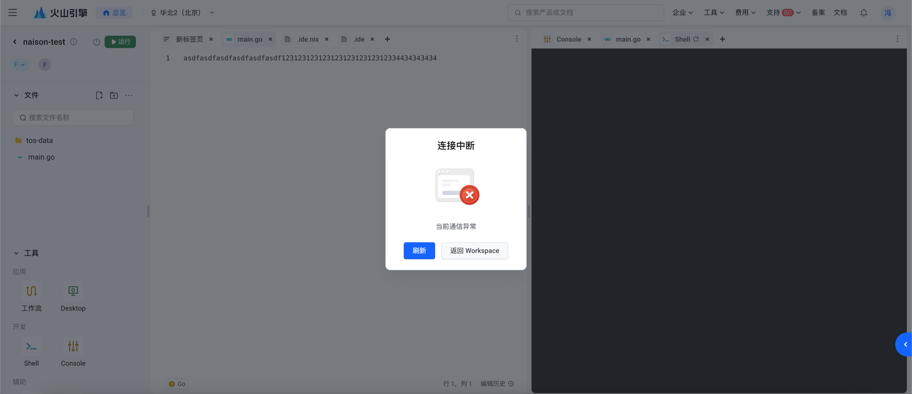

## 背景

之前做了一个 Cloud IDE，可以实现多人同时编辑同一个文件。在私有云是好好地，但是上线到公有云后，出现了 WebSocket
异常断开的问题。


## 现象

同时打开两个工作空间，一个工作空间打开多个标签页，开启 `network` 查看网络流量。然后放置不理，过一段时间后，`WebSocket`
断开。通过 `WebSocket` 中的 `ping` 和 `pong` 观察到多个网页的 `WebSocket` 基本上都是在同一时刻断开的。

- WebSocket 断开链接都是同时发生，不是一个个顺序发生的
- 相同工作空间多个标签页 `WebSocket` 断开的时刻相同
- 不同工作空间标签页 `WebSocket` 断开的时刻不同

## 初步尝试

起初的排查是链接超时时间。但是修改了超时时间后，依旧有问题。

```yaml
apiVersion: networking.k8s.io/v1
kind: Ingress
metadata:
  annotations:
    nginx.ingress.kubernetes.io/proxy-connect-timeout: "120"
    nginx.ingress.kubernetes.io/proxy-read-timeout: "120"
    nginx.ingress.kubernetes.io/proxy-send-timeout: "120"
    nginx.ingress.kubernetes.io/proxy-request-buffering: "off"
```

## 再次尝试

没有办法了，祭出大招 `tcpdump`。

```shell
root@iv-yd6qd3t0qo5i3z3c3v05:~# ps -ef | grep ingress
systemd+ 2410639 2410439  0 Jun25 ?        00:00:00 /usr/bin/dumb-init -- /nginx-ingress-controller --publish-service=kube-system/ingress-nginx-controller --election-id=ingress-controller-leader-nginx --controller-class=k8s.io/ingress-nginx --ingress-class=nginx --configmap=kube-system/ingress-nginx-controller --validating-webhook=:8443 --validating-webhook-certificate=/usr/local/certificates/cert --validating-webhook-key=/usr/local/certificates/key --watch-ingress-without-class=true -v=10
systemd+ 2410653 2410639  0 Jun25 ?        00:08:37 /nginx-ingress-controller --publish-service=kube-system/ingress-nginx-controller --election-id=ingress-controller-leader-nginx --controller-class=k8s.io/ingress-nginx --ingress-class=nginx --configmap=kube-system/ingress-nginx-controller --validating-webhook=:8443 --validating-webhook-certificate=/usr/local/certificates/cert --validating-webhook-key=/usr/local/certificates/key --watch-ingress-without-class=true -v=10
root     2602901 2602885  0 10:24 pts/0    00:00:00 grep ingress
root@iv-yd6qd3t0qo5i3z3c3v05:~# nsenter -n -t 2410653
root@iv-yd6qd3t0qo5i3z3c3v05:~# tcpdump -i eth0 -vvv -w tcpdump.pcap
```

在流量经过的每个节点抓包。从而绘制出网络拓扑图。

常用的 wireshark 过滤语句

- ip.addr == 192.0.2.1 and tcp.port not in {80, 25}
- ip.dst == 192.168.0.65 and tcp.flags.fin

使用 `tcp.flags.fin` 过滤出 `FIN` 包的链接

## 观察

从图中可以看出，`ingress-nginx-controller` 向 `ide-server` 和 控制面的 `proxy`，都发送了 `FIN`
包，从而导致链接断开。因此定位是 `ingress-nginx-controller` 的问题。

## 表层原因

虽然找到了是 `ingress-nginx-controller` 的问题，但是不知道为什么会断开，于是先去检查 `ingress` 的配置。

```shell
➜  ~ kubectl get ingress -n shared-webapp-01
NAME                        CLASS   HOSTS                ADDRESS       PORTS   AGE
ide-wco5mu3vihefepmq77ap0   nginx   ide.volcengine.com   192.168.1.7   80      62s
ide-wcptaca7ihefdlmf7ci4g   nginx   ide.volcengine.com   192.168.1.7   80      77s
```

```yaml
apiVersion: networking.k8s.io/v1
kind: Ingress
metadata:
  annotations:
    nginx.ingress.kubernetes.io/proxy-body-size: 1G
    nginx.ingress.kubernetes.io/proxy-connect-timeout: "120"
    nginx.ingress.kubernetes.io/proxy-http-version: "1.1"
    nginx.ingress.kubernetes.io/proxy-read-timeout: "120"
    nginx.ingress.kubernetes.io/proxy-request-buffering: "off"
    nginx.ingress.kubernetes.io/proxy-send-timeout: "120"
    nginx.ingress.kubernetes.io/rewrite-target: /$2
  name: ide-wco5mu3vihefepmq77ap0
  namespace: shared-webapp-01
spec:
  ingressClassName: nginx
  rules:
    - host: ide.volcengine.com
      http:
        paths:
          - backend:
              service:
                name: ide-wco5mu3vihefepmq77ap0
                port:
                  name: http
            path: /webapp-01/ide-wco5mu3vihefepmq77ap0(/|$)(.*)
            pathType: Prefix
status:
  loadBalancer:
    ingress:
      - ip: 192.168.1.7
```

一个工作空间，会创建一个 `ingress`。起初并没有觉着有什么问题。然后又对比了数据面和控制面的 `/etc/nginx/nginx.conf`
，并没有发现很明显的差异。

## 架构入手

后来看了一下设计文档，发现有个组件 `agent` 用来控制和管理 `ide` 生命周期的。想着会不会是因为这个组件出
bug 了，导致 websocket 被异常关闭。因此将数据面的 `agent` 的副本数设置为 0，然后 websocket 就稳定了。翻看了一下 agent
的代码，发现有创建/删除 ingress的操作。于是去搜了一下 `ingress-nginx-controller` 的
issue，发现有个 [#2461](https://github.com/kubernetes/ingress-nginx/issues/2461)，当 `nginx reload` 的时候，会把已经存在的
websocket 链接关闭。找到个选项 `worker-shutdown-timeout`，可以设置 `nginx reload` 的超时时间。试了之后，发现的确有效果。至此，问题的真正原因找到了。

## 真正原因

当 ingress 发生变化后，`ingress-nginx-controller` 会收集 `ingress` 的配置，然后转换为 `nginx`
的配置，然后 `nginx -s reload`。reload 的时候。先发送 `HUP` 信号给 `master process`，然后 `master process`
会发送消息给 `worker processes`，通知 `worker processes` 关闭。但如果此时 `worker processes`
上还有链接正在处理，`worker processes` 会等待链接处理完成后再关闭。如果处理时间过长，`worker processes`
会超时关闭。而超时时间就是 `worker-shutdown-timeout`。默认值是 240s，也就是 4 分钟。

https://nginx.org/en/docs/ngx_core_module.html#worker_shutdown_timeout
> Configures a timeout for a graceful shutdown of worker processes. When the time expires, nginx will try to close all
> the connections currently open to facilitate shutdown.

https://nginx.org/en/docs/control.html
> In order for nginx to re-read the configuration file, a HUP signal should be sent to the master process. The master
> process first checks the syntax validity, then tries to apply new configuration, that is, to open log files and new
> listen sockets. If this fails, it rolls back changes and continues to work with old configuration. If this succeeds,
> it
> starts new worker processes, and sends messages to old worker processes requesting them to shut down gracefully. Old
> worker processes close listen sockets and continue to service old clients. After all clients are serviced, old worker
> processes are shut down.

## 临时解决方法

增加 `worker-shutdown-timeout` 的值，比如 10
小时。测试后发现，可以解决问题。但是，这个值不能太大，否则会导致 `worker processes`
无法及时关闭，导致资源无法回收。从而导致文件描述符耗尽。无法创建出新的 `worker processes`。

https://kubernetes.github.io/ingress-nginx/user-guide/nginx-configuration/configmap/#worker-shutdown-timeout

## 解决方向

- 改架构。使用动态代理，而不是静态代理。这样就不需要 `ingress` 了。

```HOCON
events {
    worker_connections 1024;
}

http {
    # 定义服务列表
    map $uri $service_name {
        ~/service/(?<service>\w+)/* $service;
        default "";
    }

    server {
        listen 80;

        # 根据 URL 中的 path 转发到对应的服务
        location / {
            proxy_pass http://$service_name;
            proxy_set_header Host $host;
            proxy_set_header X-Real-IP $remote_addr;
            proxy_set_header X-Forwarded-For $proxy_add_x_forwarded_for;
        }
    }
}
```

- 不改架构。使用 [higress](https://github.com/alibaba/higress)
  ，阿里 [MSE](https://www.alibabacloud.com/help/en/mse/user-guide/overview-of-mse-ingress-gateways) 的开源项目，基于
  envoy 实现的动态代理，没有 reload。