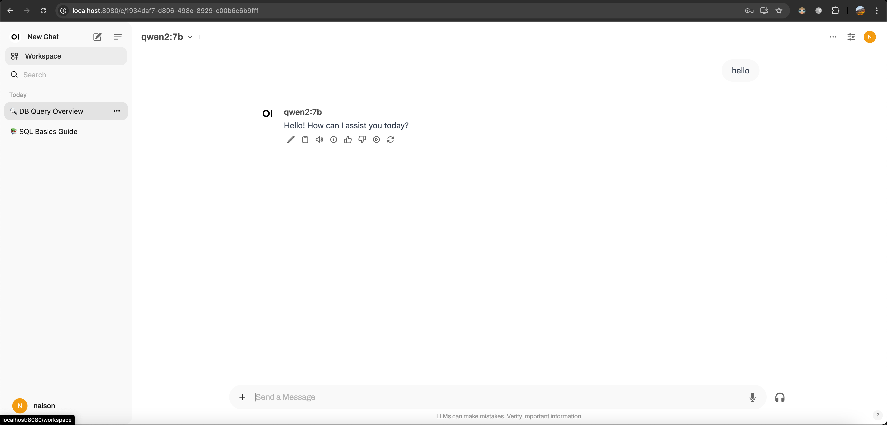

# LLM 大模型 Olloma 项目解读

## 前言

最近在看大模型的相关知识，然后想在本地启动一个 LLM ，用来做实验，然后找到了 [ollama](https://github.com/ollama/ollama)
。体验挺好的，所以拿来研究下。

## 项目

在本地构建 ollama 二进制可执行文件

- 克隆项目：git clone  https://github.com/ollama/ollama.git
- 构建依赖的 llama-server 二进制：cd ollama && ./scripts/build_darwin.sh
- 构建 ollama 二进制：CGO_ENABLED=1 GOOS=darwin GOARCH=arm64 go build

可以看到，还有许多接口

```text
POST   /api/pull
POST   /api/generate
POST   /api/chat
POST   /api/embed
POST   /api/embeddings
POST   /api/create
POST   /api/push
POST   /api/copy
DELETE /api/delete
POST   /api/show
POST   /api/blobs/:digest
HEAD   /api/blobs/:digest
GET    /api/ps
POST   /v1/chat/completions
POST   /v1/completions
POST   /v1/embeddings
GET    /v1/models
GET    /v1/models/:model
GET    /
GET    /api/tags
GET    /api/version
HEAD   /
HEAD   /api/tags
HEAD   /api/version
```

```text
time=2024-08-14T16:27:00.222+08:00 level=INFO source=memory.go:309 msg="offload to metal" layers.requested=-1 layers.model=29 layers.offload=29 layers.split="" memory.available="[21.3 GiB]" memory.required.full="5.4 GiB" memory.required.partial="5.4 GiB" memory.required.kv="448.0 MiB" memory.required.allocations="[5.4 GiB]" memory.weights.total="3.9 GiB" memory.weights.repeating="3.4 GiB" memory.weights.nonrepeating="426.4 MiB" memory.graph.full="478.0 MiB" memory.graph.partial="478.0 MiB"
time=2024-08-14T16:27:00.756+08:00 level=INFO source=server.go:393 msg="starting llama server" cmd="/var/folders/30/cmv9c_5j3mq_kthx63sb1t5c0000gn/T/ollama3971698503/runners/metal/ollama_llama_server --model /Users/bytedance/.ollama/models/blobs/sha256-43f7a214e5329f672bb05404cfba1913cbb70fdaa1a17497224e1925046b0ed5 --ctx-size 8192 --batch-size 512 --embedding --log-disable --n-gpu-layers 29 --parallel 4 --port 61974"
```

仔细看命令

```shell
ollama_llama_server --model /Users/bytedance/.ollama/models/blobs/sha256-43f7a214e5329f672bb05404cfba1913cbb70fdaa1a17497224e1925046b0ed5 --ctx-size 8192 --batch-size 512 --embedding --log-disable --n-gpu-layers 29 --parallel 4 --port 61974
```

本质上使用的是 [llama.cpp](https://github.com/ggerganov/llama.cpp) 提供的功能。直接使用 llama.cpp 的功能也可以实现相同的效果。

```shell
➜  bin ./llama-server --model /Users/bytedance/.ollama/models/blobs/sha256-43f7a214e5329f672bb05404cfba1913cbb70fdaa1a17497224e1925046b0ed5 --ctx-size 8192 --batch-size 512 --log-disable --n-gpu-layers 29 --parallel 4 --port 61974
INFO [                    main] build info | tid="0x1fa794c00" timestamp=1723624128 build=3581 commit="06943a69"
INFO [                    main] system info | tid="0x1fa794c00" timestamp=1723624128 n_threads=8 n_threads_batch=-1 total_threads=10 system_info="AVX = 0 | AVX_VNNI = 0 | AVX2 = 0 | AVX512 = 0 | AVX512_VBMI = 0 | AVX512_VNNI = 0 | AVX512_BF16 = 0 | FMA = 0 | NEON = 1 | SVE = 0 | ARM_FMA = 1 | F16C = 0 | FP16_VA = 1 | WASM_SIMD = 0 | BLAS = 1 | SSE3 = 0 | SSSE3 = 0 | VSX = 0 | MATMUL_INT8 = 0 | LLAMAFILE = 1 | "
llama_model_loader: loaded meta data with 21 key-value pairs and 339 tensors from /Users/bytedance/.ollama/models/blobs/sha256-43f7a214e5329f672bb05404cfba1913cbb70fdaa1a17497224e1925046b0ed5 (version GGUF V3 (latest))
llama_model_loader: Dumping metadata keys/values. Note: KV overrides do not apply in this output.
llama_model_loader: - kv   0:                       general.architecture str              = qwen2
llama_model_loader: - kv   1:                               general.name str              = Qwen2-7B-Instruct
llama_model_loader: - kv   2:                          qwen2.block_count u32              = 28
llama_model_loader: - kv   3:                       qwen2.context_length u32              = 32768
llama_model_loader: - kv   4:                     qwen2.embedding_length u32              = 3584
llama_model_loader: - kv   5:                  qwen2.feed_forward_length u32              = 18944
llama_model_loader: - kv   6:                 qwen2.attention.head_count u32              = 28
llama_model_loader: - kv   7:              qwen2.attention.head_count_kv u32              = 4
llama_model_loader: - kv   8:                       qwen2.rope.freq_base f32              = 1000000.000000
llama_model_loader: - kv   9:     qwen2.attention.layer_norm_rms_epsilon f32              = 0.000001
llama_model_loader: - kv  10:                          general.file_type u32              = 2
llama_model_loader: - kv  11:                       tokenizer.ggml.model str              = gpt2
llama_model_loader: - kv  12:                         tokenizer.ggml.pre str              = qwen2
llama_model_loader: - kv  13:                      tokenizer.ggml.tokens arr[str,152064]  = ["!", "\"", "#", "$", "%", "&", "'", ...
llama_model_loader: - kv  14:                  tokenizer.ggml.token_type arr[i32,152064]  = [1, 1, 1, 1, 1, 1, 1, 1, 1, 1, 1, 1, ...
llama_model_loader: - kv  15:                      tokenizer.ggml.merges arr[str,151387]  = ["Ġ Ġ", "ĠĠ ĠĠ", "i n", "Ġ t",...
llama_model_loader: - kv  16:                tokenizer.ggml.eos_token_id u32              = 151645
llama_model_loader: - kv  17:            tokenizer.ggml.padding_token_id u32              = 151643
llama_model_loader: - kv  18:                tokenizer.ggml.bos_token_id u32              = 151643
llama_model_loader: - kv  19:                    tokenizer.chat_template str              = {% if lo...
llama_model_loader: - kv  20:               general.quantization_version u32              = 2
llama_model_loader: - type  f32:  141 tensors
llama_model_loader: - type q4_0:  197 tensors
llama_model_loader: - type q6_K:    1 tensors
...
```

打开 [本地服务](http://localhost:61974)


可以看到，`llama-server` 已经内嵌了一个简单的 UI 页面，也可以切换到右上角的 `New UI`，有个更加美观的页面。在这里简单的页面上我们就可以和
LLM 大模型进行交流了。


但是 Ollama 启动的 Ollama-llama-server 这个 UI 被移除了。

```shell
curl 'http://localhost:61974/completion' \
  -H 'Accept: text/event-stream' \
  -H 'Accept-Language: en-US,en;q=0.9,zh-CN;q=0.8,zh;q=0.7' \
  -H 'Cache-Control: no-cache' \
  -H 'Connection: keep-alive' \
  -H 'Content-Type: application/json' \
  -H 'Cookie: gitea_incredible=jRSMcBghtF%3A63878871dcbaf7a40498c267e6df0b786550c2b7f8ab9e1d46d610e0affc4286' \
  -H 'DNT: 1' \
  -H 'Origin: http://localhost:61974' \
  -H 'Pragma: no-cache' \
  -H 'Referer: http://localhost:61974/' \
  -H 'Sec-Fetch-Dest: empty' \
  -H 'Sec-Fetch-Mode: cors' \
  -H 'Sec-Fetch-Site: same-origin' \
  -H 'User-Agent: Mozilla/5.0 (Macintosh; Intel Mac OS X 10_15_7) AppleWebKit/537.36 (KHTML, like Gecko) Chrome/127.0.0.0 Safari/537.36' \
  -H 'sec-ch-ua: "Not)A;Brand";v="99", "Google Chrome";v="127", "Chromium";v="127"' \
  -H 'sec-ch-ua-mobile: ?0' \
  -H 'sec-ch-ua-platform: "macOS"' \
  --data-raw '{"stream":true,"n_predict":400,"temperature":0.7,"stop":["</s>","Llama:","User:"],"repeat_last_n":256,"repeat_penalty":1.18,"penalize_nl":false,"top_k":40,"top_p":0.95,"min_p":0.05,"tfs_z":1,"typical_p":1,"presence_penalty":0,"frequency_penalty":0,"mirostat":0,"mirostat_tau":5,"mirostat_eta":0.1,"grammar":"","n_probs":0,"min_keep":0,"image_data":[],"cache_prompt":true,"api_key":"","slot_id":-1,"prompt":"This is a conversation between User and Llama, a friendly chatbot. Llama is helpful, kind, honest, good at writing, and never fails to answer any requests immediately and with precision.\n\nUser: hello\nLlama:"}'
```

```shell
➜  ~ curl 'http://localhost:61974/completion' \
  -H 'Accept: text/event-stream' \
  -H 'Accept-Language: en-US,en;q=0.9,zh-CN;q=0.8,zh;q=0.7' \
  -H 'Cache-Control: no-cache' \
  -H 'Connection: keep-alive' \
  -H 'Content-Type: application/json' \
  -H 'Cookie: gitea_incredible=jRSMcBghtF%3A63878871dcbaf7a40498c267e6df0b786550c2b7f8ab9e1d46d610e0affc4286' \
  -H 'DNT: 1' \
  -H 'Origin: http://localhost:61974' \
  -H 'Pragma: no-cache' \
  -H 'Referer: http://localhost:61974/' \
  -H 'Sec-Fetch-Dest: empty' \
  -H 'Sec-Fetch-Mode: cors' \
  -H 'Sec-Fetch-Site: same-origin' \
  -H 'User-Agent: Mozilla/5.0 (Macintosh; Intel Mac OS X 10_15_7) AppleWebKit/537.36 (KHTML, like Gecko) Chrome/127.0.0.0 Safari/537.36' \
  -H 'sec-ch-ua: "Not)A;Brand";v="99", "Google Chrome";v="127", "Chromium";v="127"' \
  -H 'sec-ch-ua-mobile: ?0' \
  -H 'sec-ch-ua-platform: "macOS"' \
  --data-raw '{"stream":true,"n_predict":400,"temperature":0.7,"stop":["</s>","Llama:","User:"],"repeat_last_n":256,"repeat_penalty":1.18,"penalize_nl":false,"top_k":40,"top_p":0.95,"min_p":0.05,"tfs_z":1,"typical_p":1,"presence_penalty":0,"frequency_penalty":0,"mirostat":0,"mirostat_tau":5,"mirostat_eta":0.1,"grammar":"","n_probs":0,"min_keep":0,"image_data":[],"cache_prompt":true,"api_key":"","slot_id":-1,"prompt":"This is a conversation between User and Llama, a friendly chatbot. Llama is helpful, kind, honest, good at writing, and never fails to answer any requests immediately and with precision.\n\nUser: hello\nLlama:"}'
data: {"content":" Hello","stop":false,"id_slot":0,"multimodal":false}

data: {"content":" there","stop":false,"id_slot":0,"multimodal":false}

data: {"content":"!","stop":false,"id_slot":0,"multimodal":false}

data: {"content":" How","stop":false,"id_slot":0,"multimodal":false}

data: {"content":" can","stop":false,"id_slot":0,"multimodal":false}

data: {"content":" I","stop":false,"id_slot":0,"multimodal":false}

data: {"content":" assist","stop":false,"id_slot":0,"multimodal":false}

data: {"content":" you","stop":false,"id_slot":0,"multimodal":false}

data: {"content":" today","stop":false,"id_slot":0,"multimodal":false}

data: {"content":"?\n\n","stop":false,"id_slot":0,"multimodal":false}

data: {"content":"","stop":false,"id_slot":0,"multimodal":false}

data: {"content":"","stop":false,"id_slot":0,"multimodal":false}

data: {"content":"","id_slot":0,"stop":true,"model":"/Users/bytedance/.ollama/models/blobs/sha256-43f7a214e5329f672bb05404cfba1913cbb70fdaa1a17497224e1925046b0ed5","tokens_predicted":12,"tokens_evaluated":47,"generation_settings":{"n_ctx":2048,"n_predict":-1,"model":"/Users/bytedance/.ollama/models/blobs/sha256-43f7a214e5329f672bb05404cfba1913cbb70fdaa1a17497224e1925046b0ed5","seed":4294967295,"temperature":0.699999988079071,"dynatemp_range":0.0,"dynatemp_exponent":1.0,"top_k":40,"top_p":0.949999988079071,"min_p":0.05000000074505806,"tfs_z":1.0,"typical_p":1.0,"repeat_last_n":256,"repeat_penalty":1.1799999475479126,"presence_penalty":0.0,"frequency_penalty":0.0,"penalty_prompt_tokens":[],"use_penalty_prompt_tokens":false,"mirostat":0,"mirostat_tau":5.0,"mirostat_eta":0.10000000149011612,"penalize_nl":false,"stop":["</s>","Llama:","User:"],"n_keep":0,"n_discard":0,"ignore_eos":false,"stream":true,"logit_bias":[],"n_probs":0,"min_keep":0,"grammar":"","samplers":["top_k","tfs_z","typical_p","top_p","min_p","temperature"]},"prompt":"This is a conversation between User and Llama, a friendly chatbot. Llama is helpful, kind, honest, good at writing, and never fails to answer any requests immediately and with precision.\n\nUser: hello\nLlama:","truncated":false,"stopped_eos":false,"stopped_word":true,"stopped_limit":false,"stopping_word":"User:","tokens_cached":58,"timings":{"prompt_n":1,"prompt_ms":1468.578,"prompt_per_token_ms":1468.578,"prompt_per_second":0.6809308051734398,"predicted_n":12,"predicted_ms":336.452,"predicted_per_token_ms":28.037666666666667,"predicted_per_second":35.66630604068337}}

➜  ~
```

## Ollama UI/GUI

UI: [open-webui](https://github.com/open-webui/open-webui)

```shell
pip install open-webui && open-webui serve
```



GUI: Hollama


## 架构


## 亮点

- 将 llama.cpp 中繁杂的操作，包装成更加简单的操作。用户不需要关心如何在本地启动项目，模型文件放在哪里，只需要选择是哪种模型，就可以直接对话。
- 更加动态的支持更多的模型，定义了 Modelfile 文件，和 Dockerfile
  文件一样。支持[模型仓库](https://github.com/ollama/ollama?tab=readme-ov-file#model-library)。
- 支持自定义 Modelfile 文件，支持导入 GGUF（GPT-Generated Unified Format） 模型文件。或者发布模型。（pull/push）
- 更加友好的图形化页面。有丰富的 [UI](https://github.com/ollama/ollama?tab=readme-ov-file#web--desktop)。