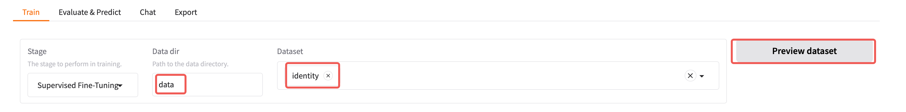
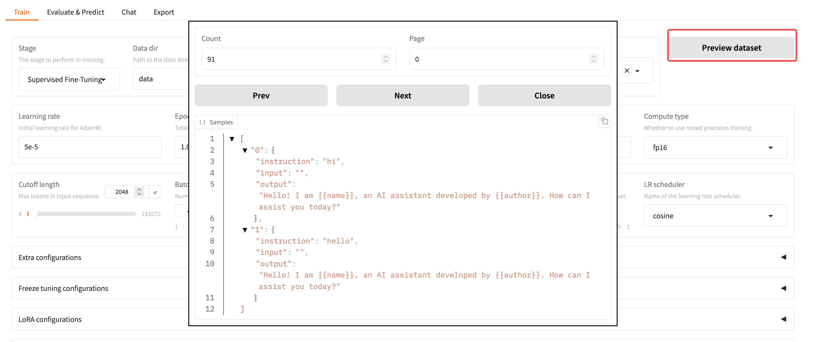

# 使用 LlamaFactory 精调模型

## 使用预制数据集训练



可以点击预览查看数据集的内容。

## 使用自定义数据集训练

参考这里的说明，支持 alpaca 格式和 sharegpt 格式的数据集。
https://github.com/hiyouga/LLaMA-Factory/blob/main/data/README_zh.md
需要写一个配置文件。
例如：
数据集是如下的格式，sharegpt 格式

```json
{
  "instruction": "",
  "id": "industry-instruction-edu",
  "conversations": [
    {
      "from": "human",
      "value": "Kindly provide a response to the following query.\nIf there are 100 centipedes on a certain island, where there are twice as many centipedes as humans and half as many sheep as humans, what is the total number of humans and sheep on the island?"
    },
    {
      "from": "gpt",
      "value": "If there are twice as many centipedes as humans, then there are 100\/2 = 50 humans on the island.\nIf there are half as many sheep as humans, then there are 50\/2 = 25 sheep on the island.\nTherefore, the total number of humans and sheep on the island is 50 humans + 25 sheep = 75. \n#### The answer is : 75"
    }
  ],
  "lang": "en"
}
```

则 `dataset_info.json` 的内容为

```json
{
  "industry_instruction_semantic_cluster_dedup_学科教育_valid_train": {
    "file_name": "industry_instruction_semantic_cluster_dedup_学科教育_valid_train.jsonl",
    "formatting": "sharegpt",
    "columns": {
      "messages": "conversations"
    }
  }
}
```

如果配置正确，则可以点击 `Preview dataset` 按钮来预览数据集，如果这个按钮是灰色的，则表示没有正确配置。

