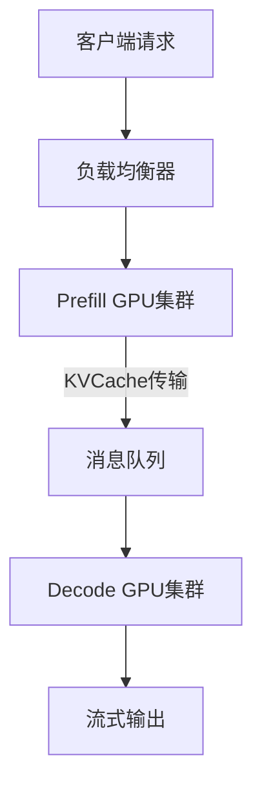
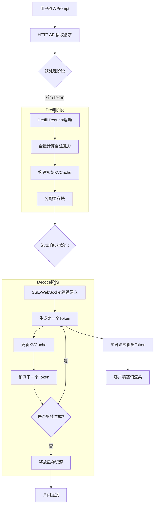

## MAAS 学习

Prefill 和 Decode 分离架构
使用 TurboRPC 通信

KVCache传输

| 技术                | 描述                        | 适用范围                        | 硬件依赖                 | 延迟  | 编程复杂度 |
|-------------------|---------------------------|-----------------------------|----------------------|-----|-------|
| Unified Memory    | 使用统一内存技术，减少显存复制，提升数据传输效率。 | CPU-GPU 异构系统，GPU 与其他设备（如网卡） | NVIDIA Pascal+ 等     | 微秒级 | 低     |
| RDMA（如 GPUDirect） | 使用显存直连技术，减少数据传输延迟，提升性能。   | GPU 与其他设备（如网卡）              | 特定 InfiniBand/NIC 硬件 | 纳秒级 | 中     |
| mmap 文件映射         | 使用文件映射技术，提升数据访问效率，降低延迟。   | CPU 访问文件/设备内存               | 无特殊要求                | 毫秒级 | 高     |

| 属性   | Prefill Request          | Decode Request             |
|------|--------------------------|----------------------------|
| 触发时机 | 处理用户输入的初始Prompt（如问题或上下文） | 生成回复的每个Token（自回归逐词生成）      |
| 计算目标 | 全量计算Prompt的注意力并构建KVCache | 仅计算最新Token的注意力，复用KVCache   |
| 数据依赖 | 独立处理完整输入序列               | 依赖前序生成的Token和缓存的KVCache    |
| 执行次数 | 每个对话仅执行1次                | 每个生成Token执行1次（循环N次，N为输出长度） |

| 对比维度     | Prefill Request               | Decode Request                 |
|----------|-------------------------------|--------------------------------|
| **触发条件** | 用户输入首个Prompt时触发               | 生成每个输出Token时循环触发               |
| **核心任务** | 1. 全量计算自注意力 2. 初始化KVCache | 1. 增量计算自注意力 2. 动态更新KVCache |
| **计算强度** | 高（O(n²)复杂度, n=输入长度）           | 低（O(1)复杂度）                     |
| **内存占用** | 高（需存储完整KVCache）               | 增量增长（每次追加新Token的KVCache）       |
| **硬件需求** | 大显存GPU集群                      | 高吞吐低延迟GPU                      |

https://github.com/efeslab/Nanoflow

在高GPU利用率场景下，由KV缓存管理 、批次构建 和完成请求筛选 组成的CPU操作开销，在推理总耗时中占据显著比例（>
10%）。为此，NanoFlow采用了如下图所示的异步控制流 机制：

在任何迭代周期i中，NanoFlow会执行以下优化：

- 预决策与资源预分配
    - 在当前迭代i结束前，提前完成下一轮迭代(i+1)的：
    - 批次策略决策 （动态批处理大小调整）
    - KV缓存条目分配 （显存空间管理）
- 非阻塞式迭代执行
    - 直接启动迭代i+1，无需等待 迭代i生成的序列结束（EOS）标记检测
- 延迟回收机制
    - 在迭代i+2阶段统一回收迭代i中已完成的请求资源
