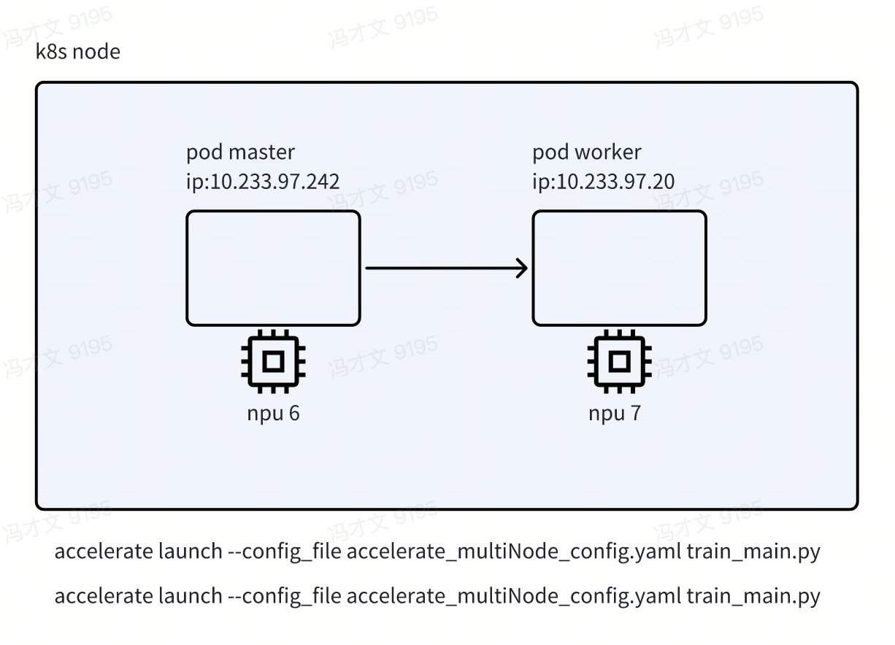
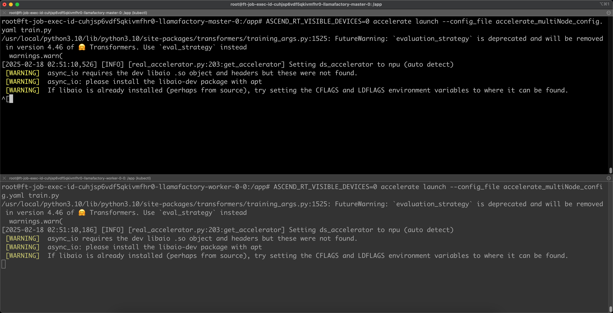
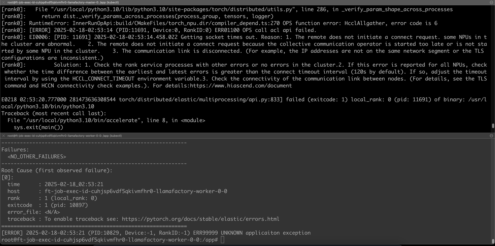

# 华为昇腾 910b3 单机多卡分布式训练报错复现



## 在一个 node 上启动两个容器

镜像：swr.cn-east-317.qdrgznjszx.com/donggang/llama-factory-ascend910b:cann8-py310-torch2.2.0-ubuntu18.04
master.yaml
```yaml
apiVersion: v1
kind: Pod
metadata:
  annotations:
    cni.projectcalico.org/containerID: 283ca17afc61b98aa5bd574c186720caa94f70717e34bf483d4d2e259a7ee65f
    cni.projectcalico.org/podIP: 10.233.97.242/32
    cni.projectcalico.org/podIPs: 10.233.97.242/32
    hami.io/Ascend910B-devices-allocated: Ascend910B-0,Ascend910B,65536,0:;
    hami.io/Ascend910B-devices-to-allocate: Ascend910B-0,Ascend910B,65536,0:;
    hami.io/bind-phase: allocating
    hami.io/bind-time: "1739785211"
    hami.io/vgpu-node: 10.56.118.17
    hami.io/vgpu-time: "1739785211"
    huawei.com/Ascend910B: '[{"UUID":"Ascend910B-0"}]'
    nvidia.com/use-gputype: Ascend910B
    predicate-time: "1739785211"
    scheduling.k8s.io/group-name: ft-job-exec-id-cuhjsp6vdf5qkivmfhr0-llamafactory-ca64c0e1-0aea-43e9-b94b-69acf80400da
  labels:
    hami.io/vgpu-node: 10.56.118.17
    maas.epscp.volcengine.com/env: smoke
    maas.epscp.volcengine.com/exec-id: job-exec-id-cuhjsp6vdf5qkivmfhr0
    maas.epscp.volcengine.com/job-id: job-id-cuhhmtoj6nrl6so7i5gg
    maas.epscp.volcengine.com/role: master
  name: ft-job-exec-id-cuhjsp6vdf5qkivmfhr0-llamafactory-master-0
  namespace: maas-task
spec:
  containers:
    - args:
        - tail
        - -f
        - /dev/null
      env:
        - name: HCCL_EXEC_TIMEOUT
          value: "1800"
      image: swr.cn-east-317.qdrgznjszx.com/donggang/llama-factory-ascend910b:cann8-py310-torch2.2.0-ubuntu18.04
      imagePullPolicy: Always
      name: train
      resources:
        limits:
          cpu: "5"
          huawei.com/Ascend910B: "1"
          huawei.com/Ascend910B-memory: "65536"
          memory: 20Gi
        requests:
          cpu: "5"
          huawei.com/Ascend910B: "1"
          huawei.com/Ascend910B-memory: "65536"
          memory: 20Gi
      terminationMessagePath: /dev/termination-log
      terminationMessagePolicy: File
      volumeMounts:
      - mountPath: /dev/shm
        name: memory-share
  dnsPolicy: ClusterFirst
  enableServiceLinks: true
  nodeName: 10.56.118.17
  nodeSelector:
    resourcepool.aicp.epscp.volcengine.com/id: cu4jr2vm53m8knmfoljg
  preemptionPolicy: PreemptLowerPriority
  priority: 0
  restartPolicy: Never
  volumes:
    - emptyDir:
        medium: Memory
      name: memory-share
```
```yaml
apiVersion: v1
kind: Pod
metadata:
  annotations:
    cni.projectcalico.org/containerID: 9e7b1e2bcf20dd4b8e322b2f52738db0431f91144136c9cd91a974a926b279e4
    cni.projectcalico.org/podIP: 10.233.97.20/32
    cni.projectcalico.org/podIPs: 10.233.97.20/32
    hami.io/Ascend910B-devices-allocated: Ascend910B-3,Ascend910B,65536,0:;
    hami.io/Ascend910B-devices-to-allocate: Ascend910B-3,Ascend910B,65536,0:;
    hami.io/bind-phase: allocating
    hami.io/bind-time: "1739785209"
    hami.io/vgpu-node: 10.56.118.17
    hami.io/vgpu-time: "1739785209"
    huawei.com/Ascend910B: '[{"UUID":"Ascend910B-3"}]'
    nvidia.com/use-gputype: Ascend910B
    predicate-time: "1739785209"
    scheduling.k8s.io/group-name: ft-job-exec-id-cuhjsp6vdf5qkivmfhr0-llamafactory-ca64c0e1-0aea-43e9-b94b-69acf80400da
  labels:
    hami.io/vgpu-node: 10.56.118.17
    maas.epscp.volcengine.com/env: smoke
    maas.epscp.volcengine.com/exec-id: job-exec-id-cuhjsp6vdf5qkivmfhr0
    maas.epscp.volcengine.com/job-id: job-id-cuhhmtoj6nrl6so7i5gg
    maas.epscp.volcengine.com/role: worker
    maas.epscp.volcengine.com/role-index: "0"
  name: ft-job-exec-id-cuhjsp6vdf5qkivmfhr0-llamafactory-worker-0-0
  namespace: maas-task
spec:
  containers:
    - args:
        - tail
        - -f
        - /dev/null
      env:
        - name: HCCL_EXEC_TIMEOUT
          value: "1800"
      image: swr.cn-east-317.qdrgznjszx.com/donggang/llama-factory-ascend910b:cann8-py310-torch2.2.0-ubuntu18.04
      imagePullPolicy: Always
      name: train
      resources:
        limits:
          cpu: "5"
          huawei.com/Ascend910B: "1"
          huawei.com/Ascend910B-memory: "65536"
          memory: 20Gi
        requests:
          cpu: "5"
          huawei.com/Ascend910B: "1"
          huawei.com/Ascend910B-memory: "65536"
          memory: 20Gi
      terminationMessagePath: /dev/termination-log
      terminationMessagePolicy: File
      volumeMounts:
        - mountPath: /dev/shm
          name: memory-share
  dnsPolicy: ClusterFirst
  enableServiceLinks: true
  nodeName: 10.56.118.17
  nodeSelector:
    resourcepool.aicp.epscp.volcengine.com/id: cu4jr2vm53m8knmfoljg
  preemptionPolicy: PreemptLowerPriority
  priority: 0
  restartPolicy: Never
  schedulerName: xgpu-scheduler
  securityContext: { }
  serviceAccount: default
  serviceAccountName: default
  terminationGracePeriodSeconds: 600
  volumes:
    - emptyDir:
        medium: Memory
      name: memory-share
```

## 下载模型 Qwen2-0.5B-Instruct

https://huggingface.co/Qwen/Qwen2-0.5B-Instruct

```shell
export HF_ENDPOINT=https://hf-mirror.com
huggingface-cli download Qwen/Qwen2-0.5B-Instruct --local-dir /mnt/model/base_model
```

## 将如下 json 文件保存为 /mnt/data/train/train.jsonl

```text
{"text": "第一章论"}
{"text": "传染病是指由病原微生物，如朊粒、病毒、衣原体、立克次体、支原体（mycoplasma)细菌真菌、螺旋体和寄生虫，如原虫、蠕虫、医学昆虫感染人体后产生的有传染性、在一定条件下可造成流行的疾病。感染性疾病是指由病原体感染所致的疾病，包括传染病和非传染性感染性疾病。"}
{"text": "传染病学是一门研究各种传染病在人体内外发生、发展、传播、诊断、治疗和预防规律的学科。重点研究各种传染病的发病机制、临床表现、诊断和治疗方法，同时兼顾流行病学和预防措施的研究，做到防治结合。"}
{"text": "传染病学与其他学科有密切联系，其基础学科和相关学科包括病原生物学、分子生物学、免疫学、人体寄生虫学、流行病学、病理学、药理学和诊断学等。掌握这些学科的基本知识、基本理论和基本技能对学好传染病学起着非常重要的作用。"}
{"text": "在人类历史长河中，传染病不仅威胁着人类的健康和生命，而且影响着人类文明的进程，甚至改写过人类历史。人类在与传染病较量过程中，取得了许多重大战果，19世纪以来，病原微生物的不断发现及其分子生物学的兴起，推动了生命科学乃至整个医学的发展；疫苗的研究诞生了感染免疫学，奠定了免疫学的理论基础，已用来研究各种疾病的发生机制及防治手段；抗生素的发现和应用被誉为20世纪最伟大的医学成就；“Koch法则“明确了传染病与病原微生物之间的因果关系，建立了病原学理论，已被广泛应用到其他许多疾病的研究，奠定了现代医学发展的基石。"}
{"text": "正是由于上述辉煌战果，加上社会文明的推进和物质生活水平的提高，人类逐渐在与传染病的斗争中占了上风。20世纪70年代西方医学界一度认为，传染病正在消亡。然而，1981年的艾滋病、2003年的传染性非典型肺炎、2012年的中东呼吸综合征、2013年的人感染H7N9禽流感、2014年的埃博拉出血热等新的传染病相继出现，不断给人类敲响警钟；与此同时，登革热、结核病、症疾及性传播疾病等老传染病再度肆虐，严重影响世界经济发展和社会和谐。20世纪90年代国际上提出了“eme1一ging infectiou s diseases\"的概念，起初被我国学者翻译为“新发传染病”，此后随着人们对感染性疾病认识的不断深入，该定义得到了修订，“新发传染病”逐渐演变为“新发感染病”，不仅包括由新种或新型病原微生物引起的新发现的感染病，而且包括近年来导致地区性或国际性公共卫生问题的再发的老感染病。新传染病的出现，老传染病的复燃，病原体对抗菌药物耐药性的增加，构成了对人类健康的巨大威胁。目前，世界卫生组织及各国政府均高度重视传染病防控工作，不断推出全球性的疾病诊断和指南，并使得传染病研究工作更容易得到跨地区、跨部门、跨领域的合作，研究成果也能更快地得到全球分享。"}
{"text": "新中国成立后，在“预防为主、防治结合”的卫生方针指引下，卫生条件明显改善，医药水平大幅提高，围生期保健工作不断加强，免疫接种覆盖率逐年提高，天花得到消灭，脊简灰质炎已接近被消灭，许多传染病如乙型脑炎、白喉、百日咳和新生儿破伤风等的发病率也明显下降。但是有些传染病如病毒性肝炎、出血热、狂犬病、结核病和感染性腹泻等仍然广泛存在；新发感染病包括变异病原体感染多次出现流行，如传染性非典型肺炎及甲型H1Nl流感的肆虐，国外流行的传染病亦有可能传入我国；烈性传染病还有可能成为生物恐怖的主要工具。因此，对传染病的防治研究仍需加强。传染病研究一直是国家重大科研项目和药物开发的重点领域，是当前国家重大科技需求。"}
{"text": "2第一章总论"}
{"text": "祖国医学对传染病的防治有丰富的经验，深入发掘和发展祖国医学研究将对中西结合防治传染病发挥重要作用。"}
{"text": "第一节感染与免疫—、感染的概念"}
```

## 将如下 python 代码保存为 train.py

```python
import json
from transformers import Trainer, TrainingArguments, AutoModel

# 加载配置
config = {
    "epochs": 10,
    "gradient_accumulation": 1,
    "lr": 0.00005,
    "model": "/mnt/model/base_model",
    "output": "/mnt/data/output",
    "resume_from_checkpoint": False,
    "reward_model": "",
    "save_total_limit": 10,
    "train_data_dir": "/mnt/data/train",
    "trainer": "pretrain",
    "valid_data_dir": "",
    "valid_data_split": 0.1,
    "warmup_ratio": 0.05
}

# 加载模型
model = AutoModel.from_pretrained(config['model'])

# 加载数据
from datasets import load_dataset
train_dataset = load_dataset('jsonl', data_files=f"{config['train_data_dir']}/train.jsonl")

# 设置训练参数
training_args = TrainingArguments(
    output_dir=config['output'],
    num_train_epochs=config['epochs'],
    per_device_train_batch_size=8,
    per_device_eval_batch_size=8,
    warmup_steps=int(len(train_dataset) * config['warmup_ratio']),
    weight_decay=0.01,
    logging_dir=f"{config['output']}/logs",
    learning_rate=config['lr'],
    save_total_limit=config['save_total_limit'],
    evaluation_strategy="epoch",
    load_best_model_at_end=False,
    metric_for_best_model="loss",
    greater_is_better=False,
    gradient_accumulation_steps=config['gradient_accumulation'],
    resume_from_checkpoint=config['resume_from_checkpoint'] if config['resume_from_checkpoint'] else None
)

# 初始化训练器
trainer = Trainer(
    model=model,
    args=training_args,
    train_dataset=train_dataset,
)

# 开始训练
trainer.train()
```

## accelerate 配置文件 accelerate_multiNode_config.yaml

master pod：

```yaml
compute_environment: LOCAL_MACHINE
debug: true
distributed_type: MULTI_GPU
downcast_bf16: 'no'
enable_cpu_affinity: false
gpu_ids: "0"
machine_rank: 0
main_process_ip: '10.233.97.242'
main_process_port: 29500
main_training_function: main
mixed_precision: fp16
num_machines: 2
num_processes: 2
rdzv_backend: static
same_network: true
tpu_env: [ ]
tpu_use_cluster: false
tpu_use_sudo: false
use_cpu: false
```

worker pod:

```yaml
debug: true
distributed_type: MULTI_GPU
downcast_bf16: 'no'
enable_cpu_affinity: false
gpu_ids: "0"
machine_rank: 1
main_process_ip: '10.233.97.242'
main_process_port: 29500
main_training_function: main
mixed_precision: fp16
num_machines: 2
num_processes: 2
rdzv_backend: static
same_network: true
tpu_env: [ ]
tpu_use_cluster: false
tpu_use_sudo: false
use_cpu: false
```

## 训练开始

分别在 master 和 worker 启动命令

```shell
accelerate launch --config_file accelerate_multiNode_config.yaml train_main.py
```





```shell
root@ft-job-exec-id-cuhjsp6vdf5qkivmfhr0-llamafactory-master-0:/app# ASCEND_RT_VISIBLE_DEVICES=0 accelerate launch --config_file accelerate_multiNode_config.yaml train.py
/usr/local/python3.10/lib/python3.10/site-packages/transformers/training_args.py:1525: FutureWarning: `evaluation_strategy` is deprecated and will be removed in version 4.46 of 🤗 Transformers. Use `eval_strategy` instead
  warnings.warn(
[2025-02-18 02:51:10,526] [INFO] [real_accelerator.py:203:get_accelerator] Setting ds_accelerator to npu (auto detect)
 [WARNING]  async_io requires the dev libaio .so object and headers but these were not found.
 [WARNING]  async_io: please install the libaio-dev package with apt
 [WARNING]  If libaio is already installed (perhaps from source), try setting the CFLAGS and LDFLAGS environment variables to where it can be found.
^[[rank0]: Traceback (most recent call last):
[rank0]:   File "/app/train.py", line 57, in <module>
[rank0]:     trainer.train()
[rank0]:   File "/usr/local/python3.10/lib/python3.10/site-packages/transformers/trainer.py", line 1938, in train
[rank0]:     return inner_training_loop(
[rank0]:   File "/usr/local/python3.10/lib/python3.10/site-packages/transformers/trainer.py", line 2095, in _inner_training_loop
[rank0]:     model, self.optimizer = self.accelerator.prepare(self.model, self.optimizer)
[rank0]:   File "/usr/local/python3.10/lib/python3.10/site-packages/accelerate/accelerator.py", line 1339, in prepare
[rank0]:     result = tuple(
[rank0]:   File "/usr/local/python3.10/lib/python3.10/site-packages/accelerate/accelerator.py", line 1340, in <genexpr>
[rank0]:     self._prepare_one(obj, first_pass=True, device_placement=d) for obj, d in zip(args, device_placement)
[rank0]:   File "/usr/local/python3.10/lib/python3.10/site-packages/accelerate/accelerator.py", line 1215, in _prepare_one
[rank0]:     return self.prepare_model(obj, device_placement=device_placement)
[rank0]:   File "/usr/local/python3.10/lib/python3.10/site-packages/accelerate/accelerator.py", line 1469, in prepare_model
[rank0]:     model = torch.nn.parallel.DistributedDataParallel(
[rank0]:   File "/usr/local/python3.10/lib/python3.10/site-packages/torch/nn/parallel/distributed.py", line 822, in __init__
[rank0]:     _verify_param_shape_across_processes(self.process_group, parameters)
[rank0]:   File "/usr/local/python3.10/lib/python3.10/site-packages/torch/distributed/utils.py", line 286, in _verify_param_shape_across_processes
[rank0]:     return dist._verify_params_across_processes(process_group, tensors, logger)
[rank0]: RuntimeError: InnerRunOpApi:build/CMakeFiles/torch_npu.dir/compiler_depend.ts:270 OPS function error: HcclAllgather, error code is 6
[rank0]: [ERROR] 2025-02-18-02:53:14 (PID:11691, Device:0, RankID:0) ERR01100 OPS call acl api failed.
[rank0]: EI0006: [PID: 11691] 2025-02-18-02:53:14.458.022 Getting socket times out. Reason: 1. The remote does not initiate a connect request. some NPUs in the cluster are abnormal.    2. The remote does not initiate a connect request because the collective communication operator is started too late or is not started by some NPU in the cluster.    3. The communication link is disconnected. (For example, the IP addresses are not on the same network segment or the TLS configurations are inconsistent.)
[rank0]:         Solution: 1. Check the rank service processes with other errors or no errors in the cluster.2. If this error is reported for all NPUs, check whether the time difference between the earliest and latest errors is greater than the connect timeout interval (120s by default). If so, adjust the timeout interval by using the HCCL_CONNECT_TIMEOUT environment variable.3. Check the connectivity of the communication link between nodes. (For details, see the TLS command and HCCN connectivity check examples.). For details:https://www.hiascend.com/document

E0218 02:53:20.777000 281473636308544 torch/distributed/elastic/multiprocessing/api.py:833] failed (exitcode: 1) local_rank: 0 (pid: 11691) of binary: /usr/local/python3.10/bin/python3.10
Traceback (most recent call last):
  File "/usr/local/python3.10/bin/accelerate", line 8, in <module>
    sys.exit(main())
  File "/usr/local/python3.10/lib/python3.10/site-packages/accelerate/commands/accelerate_cli.py", line 48, in main
    args.func(args)
  File "/usr/local/python3.10/lib/python3.10/site-packages/accelerate/commands/launch.py", line 1159, in launch_command
    multi_gpu_launcher(args)
  File "/usr/local/python3.10/lib/python3.10/site-packages/accelerate/commands/launch.py", line 793, in multi_gpu_launcher
    distrib_run.run(args)
  File "/usr/local/python3.10/lib/python3.10/site-packages/torch/distributed/run.py", line 892, in run
    elastic_launch(
  File "/usr/local/python3.10/lib/python3.10/site-packages/torch/distributed/launcher/api.py", line 133, in __call__
    return launch_agent(self._config, self._entrypoint, list(args))
  File "/usr/local/python3.10/lib/python3.10/site-packages/torch/distributed/launcher/api.py", line 264, in launch_agent
    raise ChildFailedError(
torch.distributed.elastic.multiprocessing.errors.ChildFailedError:
============================================================
train.py FAILED
------------------------------------------------------------
Failures:
  <NO_OTHER_FAILURES>
------------------------------------------------------------
Root Cause (first observed failure):
[0]:
  time      : 2025-02-18_02:53:20
  host      : ft-job-exec-id-cuhjsp6vdf5qkivmfhr0-llamafactory-master-0
  rank      : 0 (local_rank: 0)
  exitcode  : 1 (pid: 11691)
  error_file: <N/A>
  traceback : To enable traceback see: https://pytorch.org/docs/stable/elastic/errors.html
============================================================
[ERROR] 2025-02-18-02:53:20 (PID:11622, Device:-1, RankID:-1) ERR99999 UNKNOWN applicaiton exception
root@ft-job-exec-id-cuhjsp6vdf5qkivmfhr0-llamafactory-master-0:/app#
```

```shell
root@ft-job-exec-id-cuhjsp6vdf5qkivmfhr0-llamafactory-worker-0-0:/app# ASCEND_RT_VISIBLE_DEVICES=0 accelerate launch --config_file accelerate_multiNode_config.yaml train.py
/usr/local/python3.10/lib/python3.10/site-packages/transformers/training_args.py:1525: FutureWarning: `evaluation_strategy` is deprecated and will be removed in version 4.46 of 🤗 Transformers. Use `eval_strategy` instead
  warnings.warn(
[2025-02-18 02:51:10,186] [INFO] [real_accelerator.py:203:get_accelerator] Setting ds_accelerator to npu (auto detect)
 [WARNING]  async_io requires the dev libaio .so object and headers but these were not found.
 [WARNING]  async_io: please install the libaio-dev package with apt
 [WARNING]  If libaio is already installed (perhaps from source), try setting the CFLAGS and LDFLAGS environment variables to where it can be found.
[rank1]: Traceback (most recent call last):
[rank1]:   File "/app/train.py", line 57, in <module>
[rank1]:     trainer.train()
[rank1]:   File "/usr/local/python3.10/lib/python3.10/site-packages/transformers/trainer.py", line 1938, in train
[rank1]:     return inner_training_loop(
[rank1]:   File "/usr/local/python3.10/lib/python3.10/site-packages/transformers/trainer.py", line 2095, in _inner_training_loop
[rank1]:     model, self.optimizer = self.accelerator.prepare(self.model, self.optimizer)
[rank1]:   File "/usr/local/python3.10/lib/python3.10/site-packages/accelerate/accelerator.py", line 1339, in prepare
[rank1]:     result = tuple(
[rank1]:   File "/usr/local/python3.10/lib/python3.10/site-packages/accelerate/accelerator.py", line 1340, in <genexpr>
[rank1]:     self._prepare_one(obj, first_pass=True, device_placement=d) for obj, d in zip(args, device_placement)
[rank1]:   File "/usr/local/python3.10/lib/python3.10/site-packages/accelerate/accelerator.py", line 1215, in _prepare_one
[rank1]:     return self.prepare_model(obj, device_placement=device_placement)
[rank1]:   File "/usr/local/python3.10/lib/python3.10/site-packages/accelerate/accelerator.py", line 1469, in prepare_model
[rank1]:     model = torch.nn.parallel.DistributedDataParallel(
[rank1]:   File "/usr/local/python3.10/lib/python3.10/site-packages/torch/nn/parallel/distributed.py", line 822, in __init__
[rank1]:     _verify_param_shape_across_processes(self.process_group, parameters)
[rank1]:   File "/usr/local/python3.10/lib/python3.10/site-packages/torch/distributed/utils.py", line 286, in _verify_param_shape_across_processes
[rank1]:     return dist._verify_params_across_processes(process_group, tensors, logger)
[rank1]: RuntimeError: InnerRunOpApi:build/CMakeFiles/torch_npu.dir/compiler_depend.ts:270 OPS function error: HcclAllgather, error code is 6
[rank1]: [ERROR] 2025-02-18-02:53:14 (PID:10897, Device:0, RankID:1) ERR01100 OPS call acl api failed.
[rank1]: EI0006: [PID: 10897] 2025-02-18-02:53:14.537.555 Getting socket times out. Reason: 1. The remote does not initiate a connect request. some NPUs in the cluster are abnormal.    2. The remote does not initiate a connect request because the collective communication operator is started too late or is not started by some NPU in the cluster.    3. The communication link is disconnected. (For example, the IP addresses are not on the same network segment or the TLS configurations are inconsistent.)
[rank1]:         Solution: 1. Check the rank service processes with other errors or no errors in the cluster.2. If this error is reported for all NPUs, check whether the time difference between the earliest and latest errors is greater than the connect timeout interval (120s by default). If so, adjust the timeout interval by using the HCCL_CONNECT_TIMEOUT environment variable.3. Check the connectivity of the communication link between nodes. (For details, see the TLS command and HCCN connectivity check examples.). For details:https://www.hiascend.com/document

E0218 02:53:21.288000 281473116186176 torch/distributed/elastic/multiprocessing/api.py:833] failed (exitcode: 1) local_rank: 0 (pid: 10897) of binary: /usr/local/python3.10/bin/python3.10
Traceback (most recent call last):
  File "/usr/local/python3.10/bin/accelerate", line 8, in <module>
    sys.exit(main())
  File "/usr/local/python3.10/lib/python3.10/site-packages/accelerate/commands/accelerate_cli.py", line 48, in main
    args.func(args)
  File "/usr/local/python3.10/lib/python3.10/site-packages/accelerate/commands/launch.py", line 1159, in launch_command
    multi_gpu_launcher(args)
  File "/usr/local/python3.10/lib/python3.10/site-packages/accelerate/commands/launch.py", line 793, in multi_gpu_launcher
    distrib_run.run(args)
  File "/usr/local/python3.10/lib/python3.10/site-packages/torch/distributed/run.py", line 892, in run
    elastic_launch(
  File "/usr/local/python3.10/lib/python3.10/site-packages/torch/distributed/launcher/api.py", line 133, in __call__
    return launch_agent(self._config, self._entrypoint, list(args))
  File "/usr/local/python3.10/lib/python3.10/site-packages/torch/distributed/launcher/api.py", line 264, in launch_agent
    raise ChildFailedError(
torch.distributed.elastic.multiprocessing.errors.ChildFailedError:
============================================================
train.py FAILED
------------------------------------------------------------
Failures:
  <NO_OTHER_FAILURES>
------------------------------------------------------------
Root Cause (first observed failure):
[0]:
  time      : 2025-02-18_02:53:21
  host      : ft-job-exec-id-cuhjsp6vdf5qkivmfhr0-llamafactory-worker-0-0
  rank      : 1 (local_rank: 0)
  exitcode  : 1 (pid: 10897)
  error_file: <N/A>
  traceback : To enable traceback see: https://pytorch.org/docs/stable/elastic/errors.html
============================================================
[ERROR] 2025-02-18-02:53:21 (PID:10829, Device:-1, RankID:-1) ERR99999 UNKNOWN applicaiton exception
root@ft-job-exec-id-cuhjsp6vdf5qkivmfhr0-llamafactory-worker-0-0:/app#
```
