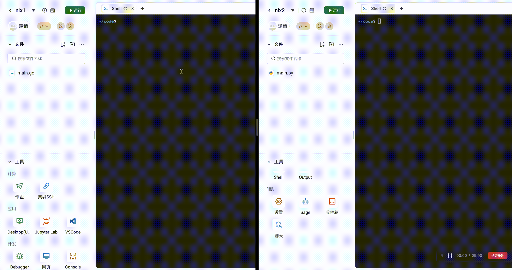

# nix 存储持久化

# 引言

## 背景

由于使用 nixpkgs 来管理和安装包。但是由于 nix 的存储没有做持久化，因此当 pod 重启后，已经下载的包和软件都需要重新下载，因此我们想将
nix 的存储持久化，避免重复下载。

## 目标

nix 已经下载的包，不用重复下载。

## 基础能力

Pod 重启后，已经下载的包可以不用下载。

## 高级能力

多个 pod 之间使用相同的存储，从而只要集群中任何一个用户下载安装了包，其他用户均不用下载。

## 需求分析

从 nix 的说明文档来看，可以将 /nix 目录存储到网盘上即可实现存储的持久化。

# 技术设计

## 架构设计

在方案调研的时候，找到了 nix.conf 的 store 配置，可以修改软件包的路径，的确可以将下载的 nix 包存储到 store 指定的路径，但是。也可以进入
shell，但是当在 shell 中使用 `nix-shell -p kubectl` 的时候，提示无法找到文件

```shell
~/code$ cat /etc/nix/nix.conf 
substituters = https://mirrors.sjtug.sjtu.edu.cn/nix-channels/store https://mirrors.bfsu.edu.cn/nix-channels/store https://mirrors.tuna.tsinghua.edu.cn/nix-channels/store https://mirrors.ustc.edu.cn/nix-channels/store https://cache.nixos.org

store = /home/runner/nix
~/code$ nix-shell -p kubevpn
build input /nix/store/kzbxgp2bini5ml5x8hpj3lni8hrqy430-kubevpn-2.2.6 does not exist
~/code$ ls -alh /nix/store/kzbxgp2bini5ml5x8hpj3lni8hrqy430-kubevpn-2.2.6
ls: cannot access '/nix/store/kzbxgp2bini5ml5x8hpj3lni8hrqy430-kubevpn-2.2.6': No such file or directory
~/code$ ls -alh /home/runner/nix/nix/store/kzbxgp2bini5ml5x8hpj3lni8hrqy430-kubevpn-2.2.6
total 1.1M
dr-xr-xr-x   3 runner run 4.0K Jan  1  1970 .
drwxr-xr-x 400 runner run 1.0M Jun 14 12:44 ..
dr-xr-xr-x   2 runner run 4.0K Jan  1  1970 bin
~/code$ 
```

手动设置 `NIX_STORE=/home/runner/nix`，会去构建而不是下载包。
所以此方法暂时不可行。采用第二种方法。挂载 `/nix` 和 `~/.local/state` 目录


## 详细设计

使用网盘，挂载 `/nix` 和 `~/.local/state` 目录。挂载 state 目录的原因是，其中有些软连接指向 `/nix/store`
，如果单纯挂载 `/nix` 目录的话，会提示找不到 `nix-shell` 命令

```yaml
        volumeMounts:
          - mountPath: /nix
            name: nix
          - mountPath: /home/runner/.local/state
            name: nixstate
        volumes:
          - hostPath:
              path: /mnt/vepfs/nix/nix
              type: Directory
            name: nix
          - hostPath:
              path: /mnt/vepfs/nix/state
              type: Directory
            name: nixstate
```

### 说明

额外需要 copy 的过程，当第一次使用新的网盘时，需要把基础镜像中的 `/nix` 和 `/home/runner/.local/state` 两个目录，copy
到网盘的 `/mnt/vepfs/nix` 和 `/mnt/vepfs/nix/state` 目录。

```shell
root@iv-yczv0pq41s5i3z3mw60r:~# tree -L 2 /mnt/vepfs/nix
/mnt/vepfs/nix
|-- nix
|   |-- store
|   `-- var
`-- state
    `-- nix

5 directories, 0 files
root@iv-yczv0pq41s5i3z3mw60r:~#
```

## 效果演示

