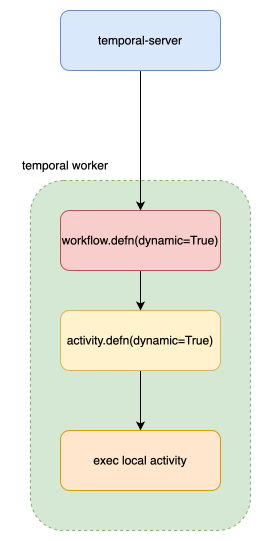
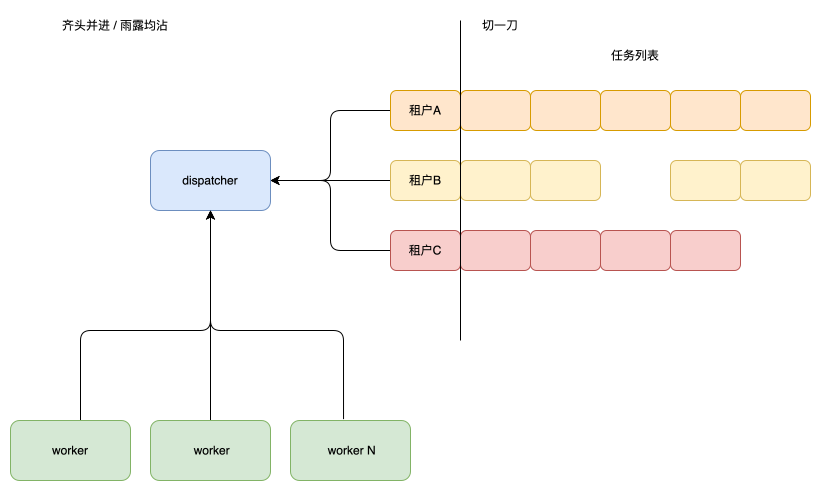
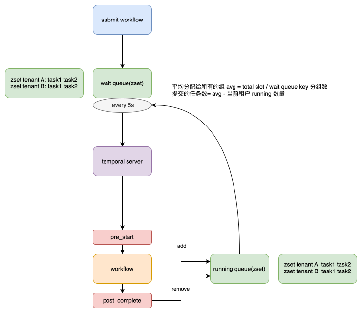

# Temporal 调优经验

## 前言

最近我们使用 temporalio 重构了 RAG 知识库部分，我负责了 temporalio 工作流引擎的调度和优化模块，因此有些经验可以分享。

## 场景

我们的使用场景是页面上上传各种类型的文档，有 ppt，word，pdf，json，jsonl，xls，md，txt，html等一系列格式的文档，然后使用 temporal
工作流引擎进行异步处理。处理流程报错，对于不同的格式有不同的解析方法。比如

| 格式   | 框架                                                           |
|------|--------------------------------------------------------------|
| PDF  | [PyMuPDF](https://github.com/pymupdf/PyMuPDF)                |
| CSV  | 标准库 csv                                                      |
| XLSX | [openpyxl](https://pypi.org/project/openpyxl/)               |
| DOCX | [docx](https://python-docx.readthedocs.io/en/latest/)        |
| PPTX | [python-pptx](https://python-pptx.readthedocs.io/en/latest/) |
| XLS  | libreoffice --> xlsx                                         |
| DOC  | libreoffice --> docx                                         |
| PPT  | libreoffice --> pptx                                         |
| HTML | [docling](https://github.com/docling-project/docling-core)   |

## 原理

我们使用到了两个关键的注解，`activity.defn(dynamic=True)` 和 `workflow.defn(dynamic=True)`，这两个注解的含义是所有调用
workflow，都会执行这个方法修饰的 workflow，所有调用 activity 都会调用到这个方法修饰的
activity。相当于是网关的入口。在拿到要执行的方法和参数后，可以通过 python 类加载的方式来运行方法，也可以使用 temporal 提供的
execute_local_activity 来调用本地的方法。

## 遇到的问题

### Temporal worker cpu 只能使用 1核 CPU

使用 sync 方法 + processpoolexecutor

由于我们的 activity 都是 async 的方法，temporal 默认会包 async 的方式放在自己的主 event loop 中来执行，所以 CPU 总是
100%，即便 Pod 的 limit 为 4c 也无济于事。后来把计算密集型的任务都改为 sync 的方式。使其在 worker 中的 activity_executor
执行，就可以使用多核 CPU 了。

### Temporal worker 由于 liveness probe 总是失败导致重启。

主要原因就是 CPU 100%，event loop 无法执行其它的 await 方法，导致 liveness server 无法响应。解决方式是单独启动了一个
thread，专门运行健康检查服务。

### Temporal 均匀消费 + 公平调度

目前由于 temporal 没有机制来保证算力平均分配。
https://community.temporal.io/t/rate-limiting-based-on-metadata/385
https://github.com/temporalio/temporal/issues/1507

比如总共有11个用户，1个用户提交了900
个任务，但是剩下的10个用户，每人提交10个，不会把这10个人提交的任务得不到运行。算力需要平均分配给所有用户。因此我们实现了一套调度机制，用来保证算力是平均分配给所有用户的。
此算法称为雨露均沾/齐头并进。

此算法需要一个元素：

- 可同时执行的任务总数

