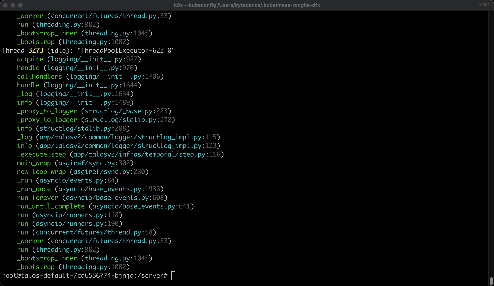

# 使用 py-spy 优化 Python worker 性能

## 前言

最近我们使用 temporalio 重构了 RAG 知识库部分，我负责了 temporalio 工作流引擎的调度和优化模块，因此有些经验可以分享。但是在后续的性能测试过程中，发现
worker 的 cpu 总是没有打满，比如给了4c，大部分时间cpu用量都是1c以下，偶尔会有使用2c核心。因此需要排查这个问题。

## 使用工具 py-spy

### 下载对应的 whl 包

https://github.com/benfred/py-spy

### 复制到容器中

```shell
kubectl cp /Users/bytedance/Downloads/py_spy-0.4.1-py2.py3-none-manylinux_2_5_x86_64.manylinux1_x86_64.whl talos-default-576ff59c74-6svxr:/server/py_spy-0.4.1-py2.py3-none-manylinux_2_5_x86_64.manylinux1_x86_64.whl -n vke-system
```

### 安装

```shell
pip install py_spy-0.4.1-py2.py3-none-manylinux_2_5_x86_64.manylinux1_x86_64.whl
```

### dump stack

```shell
py-spy dump --pid 1
```



会发现有大量的 acquired lock 的操作，检查时 log 打日志导致的。

因此调整了 log 级别。
