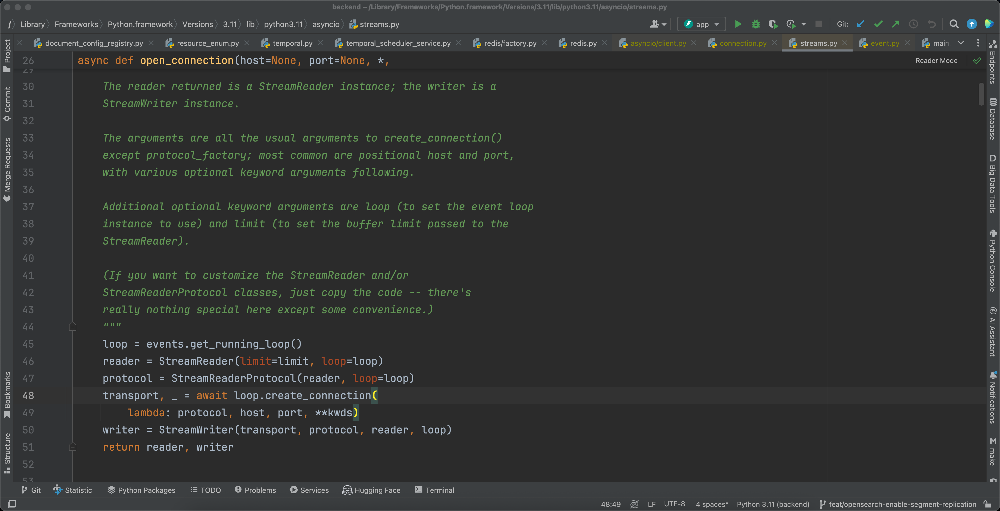

# 记录一次失败的 redis 链接数打满问题

## 背景

在 `talos-default` DFX 压测过程中，发现偶尔有几个链接 redis 的报错，另一个同事就认为可能是由于 redis
的链接数太多导致的。但是这块儿之前是我优化的，也就是使用 `async redis client` 短链接的方式。
原因：
- async redis client 在创建时，会和 event loop 绑定。如果你在另一个 event loop 中使用，会报错。
- 而如果使用单例模式，则会在一开始就创建 async redis client。

## 提出解决方案

