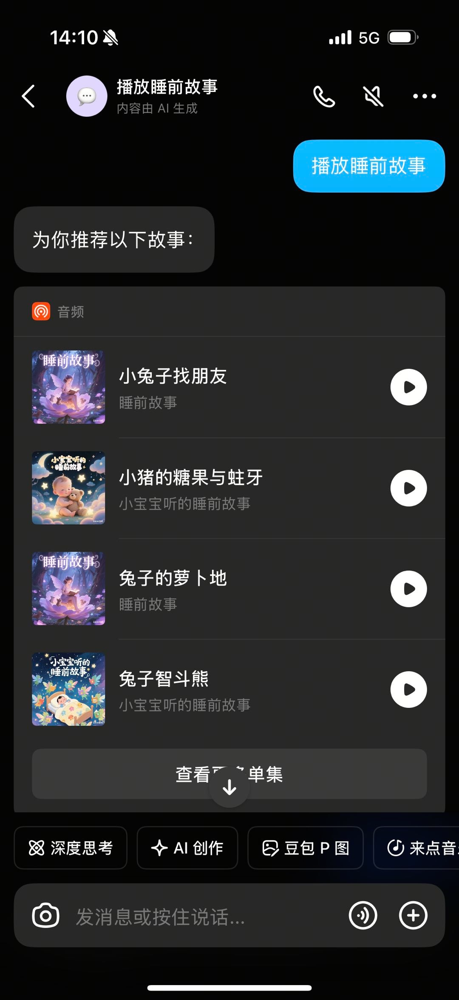
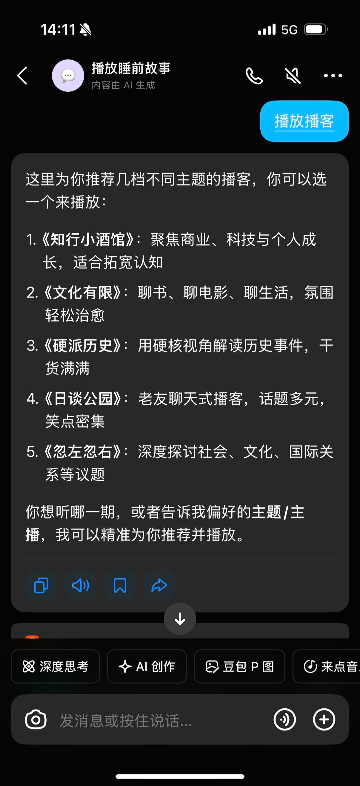
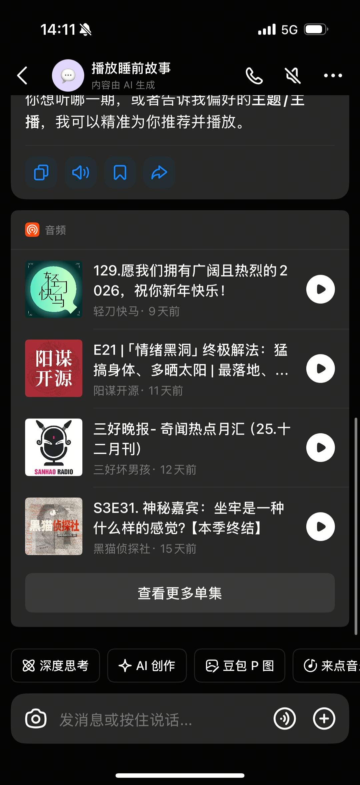
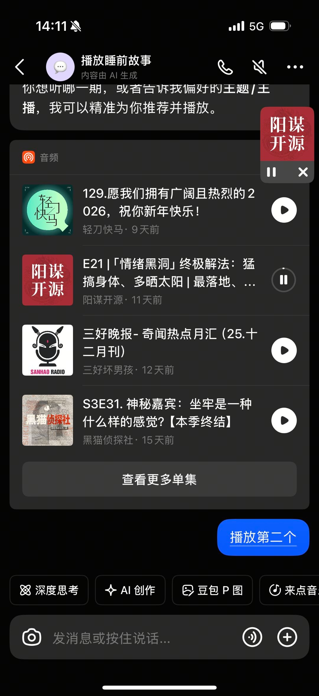
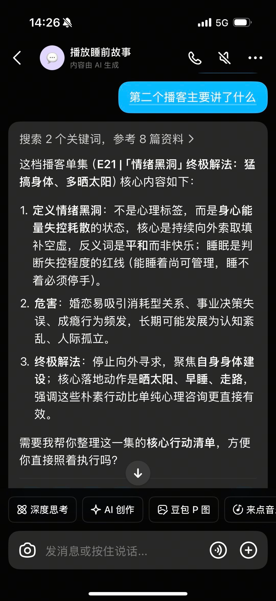
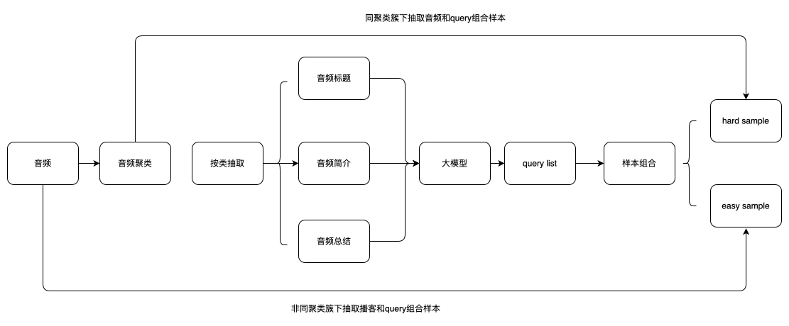
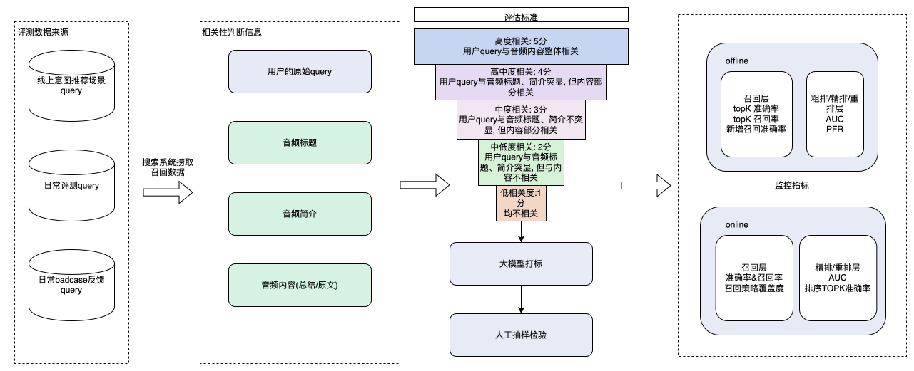
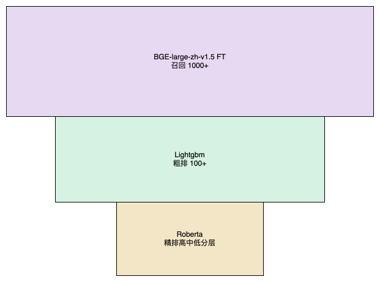
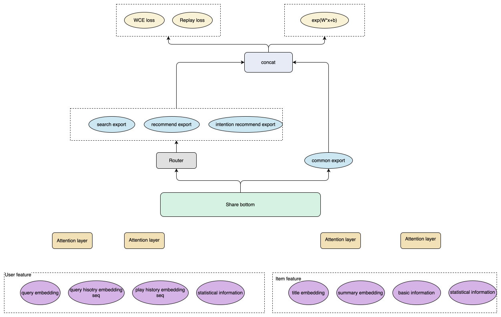

# 豆包 app 博客 agent 应用经验

早上听别人分享

## 背景

### Agent 概述

播客/故事 Agent 是豆包 App 里的一种特定垂类场景的 Agent。

- 触发机制：当用户发出相关指令（像“播放故事”、“播放播客”、“播放恐怖故事”等）时，就会触发Agent 进行回应。
- 核心呈现形式：展示前 N 条(N=4)内容总结+音频卡片。

  
  
  
  
  

### 业务目标与核心功能

主要业务目标是增加用户人均在线时长。主要具备三项功能：

1. 播控指令响应（通过用户 query 操作音频的播放、停止等）。
2. 知识问答支持（供用户针对音频中的相关问题进行作答）。
3. 相关性搜索与推荐（提升查询的相关性并推荐符合用户兴趣的音频）。

### 当前业务问题

在播客/故事场景的指标优化（人均播放时长）方面，主要面临以下几个问题：

1. 搜索相关性不足：冷启阶段样本稀疏 / 低算力，难以保证搜索准确性
2. 推荐多样性缺失：单一相关性算法导致内容同质化，核心指标（人均播放时长）增长受限
3. 物料天花板限制：物料时长偏短，高质量长时长物料供给不足

## 1. 优化搜索相关性

搜索系统的构建中，主要会遇到两个问题：

1. 缺乏样本且无人力进行打标，如果构建相关模型的训练样本？
2. 如何对线上模型的相关性进行监控？
3. 在 GPU 资源匮乏(一张卡)的情况下，如果保证低延时且高准确？

#### 1.1  LLM 生成模型训练样本

1. 可用于训练的样本数量稀少。由于query与音频的内容高度相关，因此可采用提示（prompt）的方式，输入播客的标题、简介和总结等信息来反向生成query。
2. 在负样本的构建过程中，若仅选取非同聚类簇音频query作为负样本，将导致缺乏Hard
   sample，使得模型学习过程过于简单。因此，需要从同聚类簇中抽取query，组合为hard sample（在训练集中占比 15%-20%）。构造样本量级
   100w+。
   

#### 1.2 LLM 监控线上相关性

- 评测数据源：线上意图推荐、日常评测、badcase 反馈 query
- 评分体系：1-5 分相关性标准，LLM 自动打分 + 人工抽检
- 评估指标：建立线上 / 线下双重评估体系
  

#### 1.3 粗排(Bi-Encoder)+精排(Cross-Encoder)降低时延（低算力适配）

面对只有一张 GPU 可用的情况下，采用了粗排+精排的方式既保证相关性准确性也保证时延。

1. 粗排阶段：Bi-Encoder+LightGBM/XGBoost（CPU 计算，关键词优先，取 Top100）
2. 精排阶段：Cross-Encoder（GPU 计算，RoBERTa 模型，语义模型，相关性分层排序）
   

#### 效果:

1. 豆包垂类 Agent 大考 50 分->80+分 （相关性 60分->99分）
2. 链路调用时长从500ms->130ms

## 2. 提高推荐多样性

虽然已经有了相关性模型，可确保用户搜索内容的准确性，并在一定程度上间接提升了人均播放时长。但该模型无法实现千人千面的推荐，多样性差，未对核心指标进行直接优化。主要体现在日均曝光物料数量少、核心用户日均播放时长短且留存率低等阶段性指标上。
为此，面对核心指标的优化做了以下改造：

1. 场景拆分，拆分出搜索场景和推荐场景进行分别优化。
2. 构建兴趣召回链路和兴趣精排模型分别插入搜索和推荐场景。
3. 设计模型优化 loss，直接以人均播放作为目标进行优化。

#### 2.1 链路改造

1. 场景拆分：搜索 / 推荐场景独立优化
2. 兴趣模型插入：推荐场景新增兴趣召回链路；搜索场景插入粗排与精排之间
   This content is only supported in a Feishu Docs

#### 2.2 模型优化

模型的目标以优化人均播放时长作为目标。在模型设计上，我们分别对 loss 层和特征表达层进行了多种尝试设计：

##### loss 设计:

- 初期采用 essm，以点击播放作为 CTR，播放完成度作为
  CVR。AB实验结果，用户点击播放率和人均播播放时长显著提升，但点击播放时长天花板(初期强相关中间指标)
  并未提升。但模型更倾向于推荐时长较短的音频，不利于提高点击播放时长天花板。
- 用回归转分类的方法，把 WCE 当作 loss，播放时长作为学习目标。AB
  实验结果，用户人均播放时长和点击播放时长上限显著提高，点击播放率有波动且呈上升趋势。对用户做分层分析发现，新用户的点击播放率波动呈负向，这表明在用户端冷启动阶段，推荐长时间音频收益更高，但可能没考虑到用户的偏好。
- 后续加入因果推断(IPTW)和用户是否复访作为学习 loss。AB 实验结果，用户人均播放时长和点击播放时长上限波动提升，点击播放率显著提升。

##### 特征层设计：

- 使用用户历史序列特征(query 历史、播放音频历史等)，使用attention 对 session query 和 session audio 进行交叉，学习用户历史偏好。
- 采用 MMOE 架构，拆分多场景 export，分别学习不同场景需求差异。
- 采用 rqe-vae(生成式推荐)，生成物料语义 id ，解决无业务设定物料类目问题和物料冷启问题。
- 添加 audio embedding 多模态特征，刻画用户对音频背景音乐、主播声音的偏好。
  

#### 效果:

1. 人均播放时长 13 分钟->25分钟。
2. 人均播放播客次数从 3.2 ->4。人均完播次数从 1.24 -> 1.77。

## 3. 提高物料天花板

音频 Agent 主要功能为播放故事（播放人群占比 90%+，访问时间段集中在 22 点）。不过，其音频多源自外网爬取，物料资源存在时长偏短（50%物料时长低于
7 分钟）、更新停滞、质量不佳、数量较少（故事物料5w+%，占比总体物料的 15%）的问题。物料质量决定了推荐的天花板。

### 3.1 高质量物料定义

通过与抖音故事大 V 和内部数据分析，定义什么是高质量物料：

1. 声音：柔和背景音乐、多人物对话、慢语速。
2. 内容：成语故事、格林童话、伊索寓言等经典题材故事。
   This content is only supported in a Feishu Docs

#### 效果：

AB 实验，人均播放时长和播放率显著提升

## 总结

通过搜索相关性优化、推荐多样性提升、物料质量升级，豆包 App 播客 / 故事垂类 Agent 的核心指标（人均播放时长）实现翻倍增长，用户体验与业务价值同步提升。