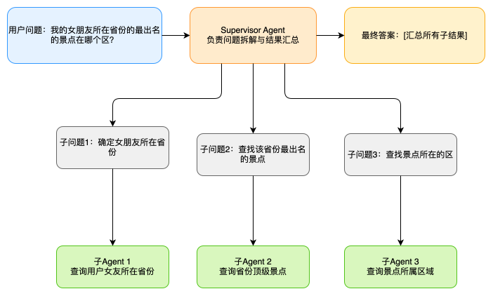

# Graph RAG 学习

## 背景

平台上有 graph rag 的需求，虽然不是我做的，但是学习一下总是好的。

## 概念

Graph RAG 就是知识图谱

## 为什么

为什么需要知识图谱尼？原因就是，知识图谱擅长解决关系问题。
比如，

- 我的女朋友所在的省份有什么著名景点？
- 我经常去的图书馆所在的区有什么好吃的？

你会发现，这样的问题往往都有两层，

- 第一层：我的女朋友的省份？
- 第二层：这个省份有哪些景点？

对于传统的 rag 来说，召回文档要么是全文检索，要么是语义检索，但是它们都无法直接能够检索到结果，因为结果是有逻辑关系的。

而检索回来的，大约都是一些片段。然后把这些片段交给大模型，让大模型输出最终的结果，其实是在考验大模型的推理能力了。因为我们提供的上下文实际上不是特别价值。
那么如果这个问题在进一步扩展，如果关系再多一层。就会更加复杂了。比如

- 我的女朋友所在省份的最出名的景点在哪个区？

那么这个问题就有了三层

- 第一层：我的女朋友所在的省份？
- 第二层：女朋友所在省份的景点？
- 第三层：景点所在的区？

对于传统 rag ，可能就无法很好的来处理问题了，可能召回的都是只言片语，不够连贯的句子。然后尝试交给大模型。

## 其它思路

实际上，这是不是有点儿像是 `agentic agent`，这些 agent 可以拆解大问题为小问题，然后一个个来解决。比如就还是上面的问题。使用
`agentic agent` + `rag`，react 模式，每次解决一个问题。

- TODO list

所以实际上，为了解决复杂问题，有两条路。

- agent：从流程上出发
- graph rag：一种是从 rag 出发 
