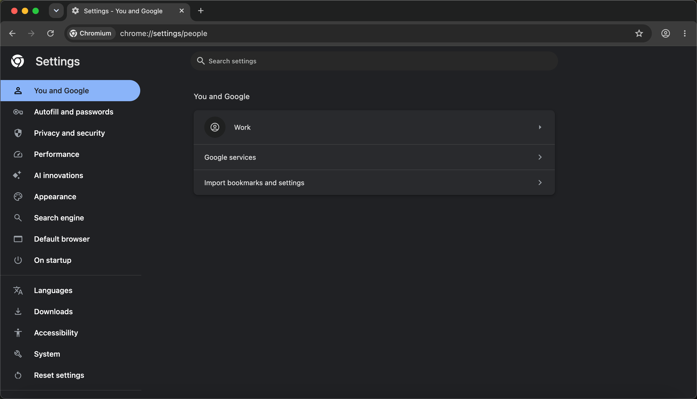
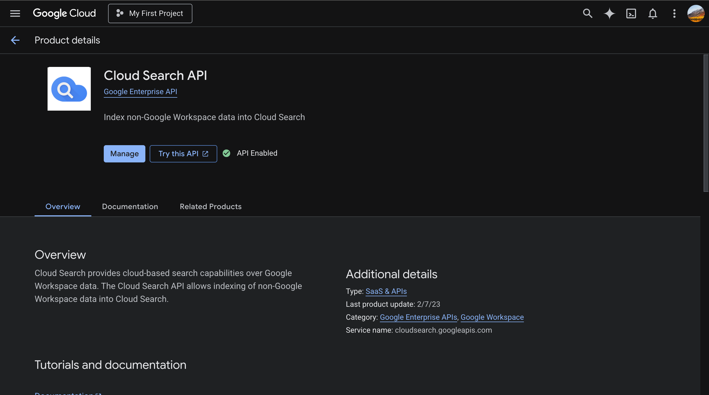
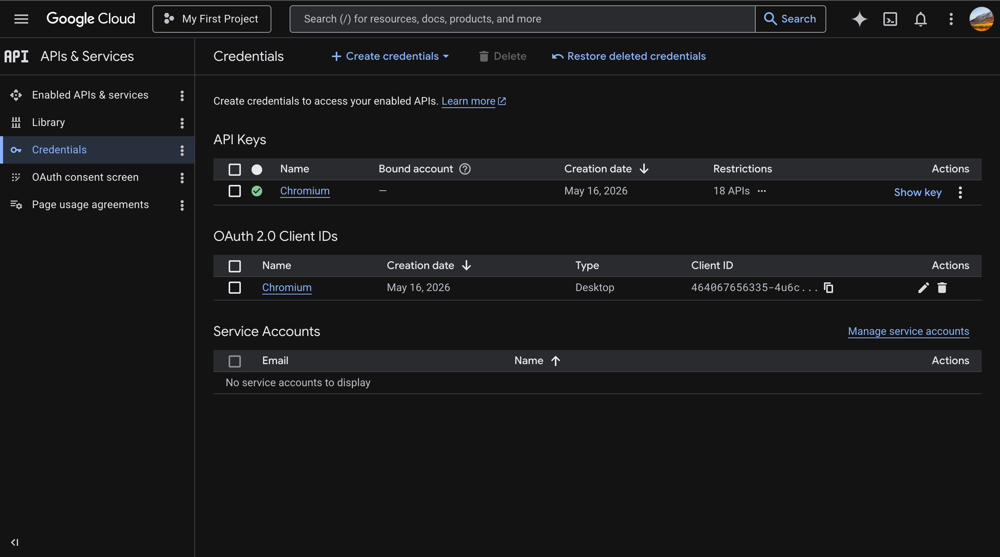
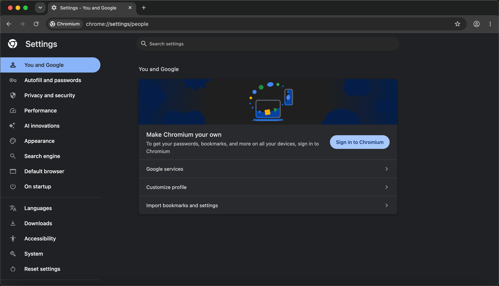
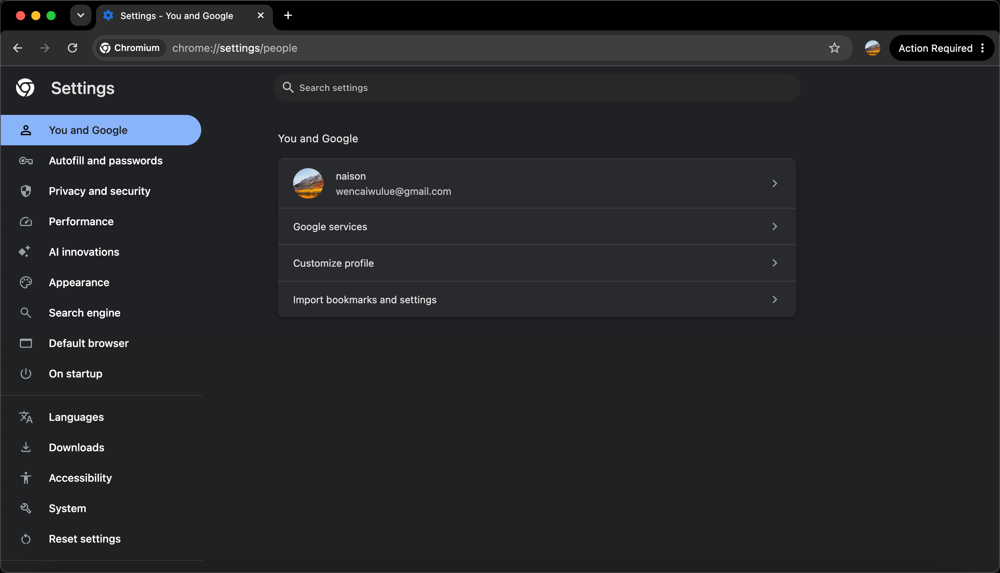

# 在 macOS 上实现 chromium 和 chrome 浏览器双向同步

## 背景

由于一些特殊原因，没法儿使用 google chrome 浏览器，所以使用开源的 chromium 浏览器来替代，但是发现 chromium 没法儿同步
Chrome 浏览器的书签和浏览历史，因此想到看看有没有什么办法来使得 chromium 同步 chrome，之前也有尝试过其他的一些 sync
插件的方式，感觉不是很方便，并且上传个人信息到第三方感觉不怎么靠谱，还是使用 google 自家的服务比较安心，所以有了如下的探索。

## 材料

### 1. 下载最新的 chromium 浏览器

https://download-chromium.appspot.com/

运行提示损坏，直接运行命令:

```shell
xattr -cr /Applications/Chromium.app
```

打开浏览器，是没有 google 同步的



### 2. Enable Google APIs                                                 

打开网站 https://console.cloud.google.com/apis ，启动如下的 API

```text
Cloud Search API
Geolocation API （好像不开也行，应该是获取位置的接口）
Google Drive API
Safe Browsing API
Time Zone API
```



### 3. 开启 Google Oauth 认证

分别创建 `API key` 和 `OAuth client ID` 类型的认证方式，并且获取到 `client_id` `client_secret` `api_key`



### 4. 写入永久配置

```shell
plutil -remove LSEnvironment /Applications/Chromium.app/Contents/Info.plist
plutil -insert LSEnvironment -json '{"GOOGLE_API_KEY":"你的_API_KEY", "GOOGLE_DEFAULT_CLIENT_ID":"你的_CLIENT_ID", "GOOGLE_DEFAULT_CLIENT_SECRET":"你的_CLIENT_SECRET"}' /Applications/Chromium.app/Contents/Info.plist
/System/Library/Frameworks/CoreServices.framework/Frameworks/LaunchServices.framework/Support/lsregister -v -f /Applications/Chromium.app/Contents/Info.plist
sudo codesign --force --deep --sign - /Applications/Chromium.app
```

### 5. 检查是否有同步入口

打开浏览器的设置页面，可以看到有登陆 Google 的入口，切记还没有完成，直接登陆 chromium 浏览器会遇到网页登陆成功， 但是
chromium 提示没有登陆



### 6. 最重要的一步

加入 Google 群组如下群组，亲测只需要加入第一个即可

- [chromium-dev](https://groups.google.com/a/chromium.org/g/chromium-dev)
- [google-browser-signin-testaccounts](https://groups.google.com/u/0/a/chromium.org/g/google-browser-signin-testaccounts)

然后重新登陆 chromium 浏览器，大功告成～
