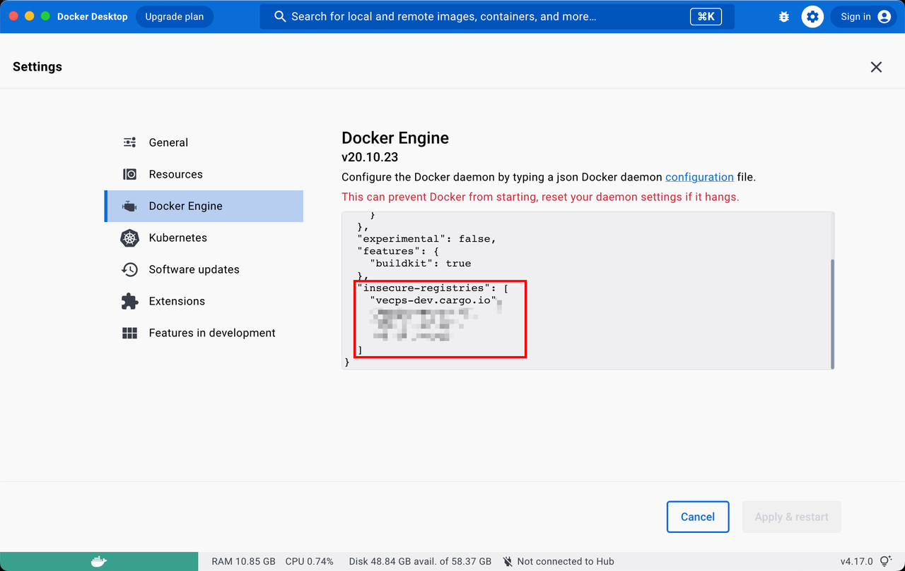

# KubeVPN工具使用实践

[KubeVPN](https://github.com/wencaiwulue/kubevpn/releases)
该工具会创建隧道，在集群里起一个pod做DNS解析+流量转发，用来在本地打通集群服务联调, 下面是一些场景下的实践

## 通过跳板机连接的集群，推送镜像

构建镜像可以在 http://10.37.12.51:5211/api/#/build/build 这里触发接口调用

1, 在本地 ~/.ssh/config 文件里添加好配置，示例：

```shell
Host jump-server
Hostname 36.110.140.184
User root
Port 22
IdentityFile /Users/bytedance/.ssh/byte.pem  # 必须是绝对路径

Host tianyi
ProxyJump jump-server
Hostname 10.1.1.154
User root
Port 22
IdentityFile /Users/bytedance/.ssh/byte.pem  # 必须是绝对路径
```

注意设置正确 IdentityFile 文件路径&权限：

```shell
chmod 400 ~/.ssh/byte.pem
```

判断成功：执行 ssh tianyi 查看是否能够连到服务器

2, 下载 kubevpn 二进制文件到本地，并使用它来连到集群，示例：

```shell
# 添加集群离线源域名解析到本地 /etc/hosts
sudo vi /etc/hosts

# 添加以下解析
10.1.1.154 vecps-dev.cargo.io

# 下载集群配置文件 kubeconfig 到本地
scp tianyi:~/.kube/config ./ry-tianyi.original

# 起一个 screen 来管理进程后台运行，可选
screen -S kubevpn

# 设置集群配置文件环境变量，当前使用 kubevpn --kubeconfig 有bug
export KUBECONFIG=~/ry-tianyi.original

# 启动 kubevpn 隧道
kubevpn connect -n vke-system --ssh-alias tianyi --extra-cidr 10.1.1.154/32

```

3. 修改 Docker 配置，设置 insecure-registries
   
   判断成功：执行 docker info 查看 Insecure Registries: ... 是否有目标镜像仓库地址
4. 本地 Docker 登录到离线源上的镜像仓库，天翼云冒烟环境需要

```shell
docker login vecps-dev.cargo.io
Username: admin
Password: Bytedance@789
```

5. 本地拉取镜像，并推送到集群离线源上的镜像仓库，可以创建一个脚本来执行：

```shell
# 修改这一行为目标镜像地址
export IMAGE=infcs/privatecloud_web_engine:5e28bc0f787d2c1b6a82bcd9141c1099

export BYTED_HOST=hub.byted.org
export REGISTRY_HOST=vecps-dev.cargo.io

export ORIGIN_URL=$BYTED_HOST/$IMAGE
export TARGET_URL=$REGISTRY_HOST/$IMAGE

set -x
docker pull $ORIGIN_URL
docker tag $ORIGIN_URL $TARGET_URL
docker push $TARGET_URL
docker rmi -f $ORIGIN_URL $TARGET_URL # 清理本地镜像，可选

# 更多封装好的 cli:
# https://code.byted.org/infcp/customized-paas-fe-dev-tools/tree/master/packages/deploy/cli
```

6. 手动更新deployment的镜像

```shell
# 找到 kubevpn 启动后的输出：
...
using temp kubeconfig /var/folders/b1/0fd1b6hs7lz0fm_mh346lybm0000gn/T/2210734224.kubeconfig
...

# 使用这个 kubeconfig
export KUBECONFIG=/var/folders/b1/0fd1b6hs7lz0fm_mh346lybm0000gn/T/2210734224.kubeconfig

# 更新 Graphql 类镜像，以及 vecompass-insight-web
IMAGE=vecps-dev.cargo.io/epscprelease/registryhub-graphql:tag &&
DEPLOYMENT=registryhub-graphql &&
kubectl patch deployment/$DEPLOYMENT -n vke-system --type='json'
-p="[{\"op\": \"replace\", \"path\": \"/spec/template/spec/containers/0/image\", \"value\":\"$IMAGE\"}]"

# 更新 Web 类镜像：
IMAGE=vecps-dev.cargo.io/epscprelease/registryhub-web:tag &&
DEPLOYMENT=registryhub-web &&
kubectl patch deployment/$DEPLOYMENT -n vke-system --type='json'
-p="[{\"op\": \"replace\", \"path\": \"/spec/template/spec/initContainers/0/image\", \"value\":\"$IMAGE\"}]"

# 更新 volc-web 镜像：
IMAGE=vecps-dev.cargo.io/infcs/privatecloud_web_engine:5e28bc0f787d2c1b6a82bcd9141c1099 &&
DEPLOYMENT=volc-web &&
kubectl patch deployment/$DEPLOYMENT -n cadp-system --type='json'
-p="[{\"op\": \"replace\", \"path\": \"/spec/template/spec/containers/0/image\", \"value\":\"$IMAGE\"},{\"op\": \"replace\", \"path\": \"/spec/template/spec/containers/1/image\", \"value\":\"$IMAGE\"}]"
```

7. 使用本地 kubectl / k9s 查看集群信息

```shell
# 找到 kubevpn 启动后的输出：
...
using temp kubeconfig /var/folders/b1/0fd1b6hs7lz0fm_mh346lybm0000gn/T/2210734224.kubeconfig
...

# 使用这个 kubeconfig
export KUBECONFIG=/var/folders/b1/0fd1b6hs7lz0fm_mh346lybm0000gn/T/2210734224.kubeconfig

# 现在可以执行 kubectl / k9s 了：
kubectl get product
k9s
```

# 2. 使用集群里Deployment同样的env，本地启动服务

可以不用将依赖的服务从 ClusterIP 改成 NodePort 来访问

1. 使用 kubevpn 连接到目标集群，参考上面 1.1 / 1.2

```shell
# 设置集群配置文件环境变量，当前使用 kubevpn --kubeconfig 有bug
export KUBECONFIG=~/ry-tianyi.original

# 启动 kubevpn 隧道
kubevpn connect -n vke-system --ssh-alias tianyi
```

2. 修改本地项目的启动脚本，把环境变量改成和集群里 Deployment 同样的 env
   注意：如果服务地址和你启动kubevpn连接时指定的命名空间不同，需要在地址后面添加命名空间，如：

```shell
# 集群里 Deployment 的命名空间是 cadp-system，环境变量访问了解密服务，因为二者所处同命名空间所以环境变量里可以不加命名空间：
https://cadp-security-server:6789

# 但是我们在第一步本地启动 kubevpn 的时候指定的命名空间是 vke-system，所以和解密服务不同命名空间，本地使用这个地址的时候要加上对应的命名空间：
https://cadp-security-server.cadp-system:6789

# 或者在第一步连接 kubevpn 的时候就指定 Deployment 所在的命名空间，这样就可以不做修改了
```

3. 本地启动项目进行开发
   其他链接

- RY环境信息汇总：http://10.37.12.51/deploy/