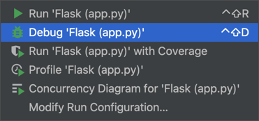

# 使用 pycharm 调试python flask 应用报错了

## Flask integration

如果不使用 flask 类型的调试器，pycharm 的表现会很奇怪，击不中断点，活着无法正常调试

要显示为这样才是可以正常使用的。

也就是需要打开这个开关: Flask integration

## Gevent compatible

也就是需要打开开关: Gevent compatible

不开的话，会这样

