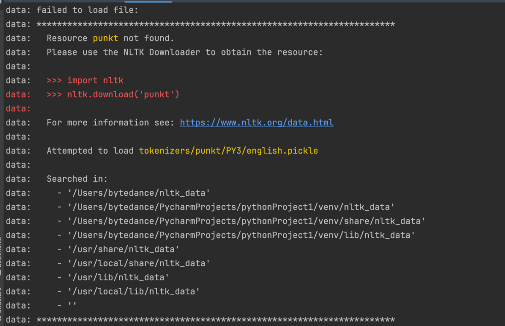

```shell
bash '/Applications/Python 3.6/Install Certificates.command'
```
```shell
python -c "import nltk; nltk.download('punkt')"
```

```text
(venv) ➜  pythonProject1 python3                                 
Python 3.10.11 (v3.10.11:7d4cc5aa85, Apr  4 2023, 19:05:19) [Clang 13.0.0 (clang-1300.0.29.30)] on darwin
Type "help", "copyright", "credits" or "license" for more information.
>>> import nltk
>>> nltk.download()
showing info https://raw.githubusercontent.com/nltk/nltk_data/gh-pages/index.xml
True
>>> 2023-12-04 20:19:28.963 Python[34729:4214482] WARNING: Secure coding is not enabled for restorable state! Enable secure coding by implementing NSApplicationDelegate.applicationSupportsSecureRestorableState: and returning YES.

>>> nltk.download('punkt')

[nltk_data] Error loading punkt: <urlopen error [SSL:
[nltk_data]     CERTIFICATE_VERIFY_FAILED] certificate verify failed:
[nltk_data]     unable to get local issuer certificate (_ssl.c:1007)>
False
>>> 
>>> nltk.download('punkt')
[nltk_data] Error loading punkt: <urlopen error [SSL:
[nltk_data]     CERTIFICATE_VERIFY_FAILED] certificate verify failed:
[nltk_data]     unable to get local issuer certificate (_ssl.c:1007)>
False
>>> nltk.download('punkt')


[nltk_data] Error loading punkt: <urlopen error [SSL:
[nltk_data]     CERTIFICATE_VERIFY_FAILED] certificate verify failed:
[nltk_data]     unable to get local issuer certificate (_ssl.c:1007)>
False
>>> 
>>> 
>>> exit
Use exit() or Ctrl-D (i.e. EOF) to exit
>>> exit()
```
```text
(venv) ➜  pythonProject1 curl -X 'POST' \               
  'http://127.0.0.1:6789/score' \
  -H 'Content-Type: multipart/form-data' \
  -F 'file=@download.txt;type=text/plain'
data: begin to process download.txt

data: failed to load file: 
data: **********************************************************************
data:   Resource punkt not found.
data:   Please use the NLTK Downloader to obtain the resource:
data: 
data:   >>> import nltk
data:   >>> nltk.download('punkt')
data:   
data:   For more information see: https://www.nltk.org/data.html
data: 
data:   Attempted to load tokenizers/punkt/PY3/english.pickle
data: 
data:   Searched in:
data:     - '/Users/bytedance/nltk_data'
data:     - '/Users/bytedance/PycharmProjects/pythonProject1/venv/nltk_data'
data:     - '/Users/bytedance/PycharmProjects/pythonProject1/venv/share/nltk_data'
data:     - '/Users/bytedance/PycharmProjects/pythonProject1/venv/lib/nltk_data'
data:     - '/usr/share/nltk_data'
data:     - '/usr/local/share/nltk_data'
data:     - '/usr/lib/nltk_data'
data:     - '/usr/local/lib/nltk_data'
data:     - ''
data: **********************************************************************
data: 

(venv) ➜  pythonProject1 pip install -r requirements.txt
Requirement already satisfied: aiohttp==3.9.1 in ./venv/lib/python3.10/site-packages (from -r requirements.txt (line 1)) (3.9.1)
Requirement already satisfied: aiosignal==1.3.1 in ./venv/lib/python3.10/site-packages (from -r requirements.txt (line 2)) (1.3.1)
Requirement already satisfied: annotated-types==0.6.0 in ./venv/lib/python3.10/site-packages (from -r requirements.txt (line 3)) (0.6.0)
Requirement already satisfied: anyio==3.7.1 in ./venv/lib/python3.10/site-packages (from -r requirements.txt (line 4)) (3.7.1)
Requirement already satisfied: attrs==23.1.0 in ./venv/lib/python3.10/site-packages (from -r requirements.txt (line 5)) (23.1.0)
Requirement already satisfied: backoff==2.2.1 in ./venv/lib/python3.10/site-packages (from -r requirements.txt (line 6)) (2.2.1)
Requirement already satisfied: beautifulsoup4==4.12.2 in ./venv/lib/python3.10/site-packages (from -r requirements.txt (line 7)) (4.12.2)
Requirement already satisfied: certifi==2023.11.17 in ./venv/lib/python3.10/site-packages (from -r requirements.txt (line 8)) (2023.11.17)
Requirement already satisfied: chardet==5.2.0 in ./venv/lib/python3.10/site-packages (from -r requirements.txt (line 9)) (5.2.0)
Requirement already satisfied: charset-normalizer==3.3.2 in ./venv/lib/python3.10/site-packages (from -r requirements.txt (line 10)) (3.3.2)
Requirement already satisfied: click==8.1.7 in ./venv/lib/python3.10/site-packages (from -r requirements.txt (line 11)) (8.1.7)
Requirement already satisfied: dataclasses-json==0.6.3 in ./venv/lib/python3.10/site-packages (from -r requirements.txt (line 12)) (0.6.3)
Requirement already satisfied: emoji==2.8.0 in ./venv/lib/python3.10/site-packages (from -r requirements.txt (line 13)) (2.8.0)
Requirement already satisfied: fastapi==0.104.1 in ./venv/lib/python3.10/site-packages (from -r requirements.txt (line 14)) (0.104.1)
Requirement already satisfied: filelock==3.13.1 in ./venv/lib/python3.10/site-packages (from -r requirements.txt (line 15)) (3.13.1)
Requirement already satisfied: filetype==1.2.0 in ./venv/lib/python3.10/site-packages (from -r requirements.txt (line 16)) (1.2.0)
Requirement already satisfied: frozenlist==1.4.0 in ./venv/lib/python3.10/site-packages (from -r requirements.txt (line 17)) (1.4.0)
Requirement already satisfied: fsspec==2023.12.0 in ./venv/lib/python3.10/site-packages (from -r requirements.txt (line 18)) (2023.12.0)
Requirement already satisfied: greenlet==3.0.1 in ./venv/lib/python3.10/site-packages (from -r requirements.txt (line 19)) (3.0.1)
Requirement already satisfied: h11==0.14.0 in ./venv/lib/python3.10/site-packages (from -r requirements.txt (line 20)) (0.14.0)
Requirement already satisfied: huggingface-hub==0.19.4 in ./venv/lib/python3.10/site-packages (from -r requirements.txt (line 21)) (0.19.4)
Requirement already satisfied: idna==3.6 in ./venv/lib/python3.10/site-packages (from -r requirements.txt (line 22)) (3.6)
Requirement already satisfied: Jinja2==3.1.2 in ./venv/lib/python3.10/site-packages (from -r requirements.txt (line 23)) (3.1.2)
Requirement already satisfied: joblib==1.3.2 in ./venv/lib/python3.10/site-packages (from -r requirements.txt (line 24)) (1.3.2)
Requirement already satisfied: jsonpatch==1.33 in ./venv/lib/python3.10/site-packages (from -r requirements.txt (line 25)) (1.33)
Requirement already satisfied: jsonpointer==2.4 in ./venv/lib/python3.10/site-packages (from -r requirements.txt (line 26)) (2.4)
Requirement already satisfied: langchain==0.0.345 in ./venv/lib/python3.10/site-packages (from -r requirements.txt (line 27)) (0.0.345)
Requirement already satisfied: langchain-core==0.0.9 in ./venv/lib/python3.10/site-packages (from -r requirements.txt (line 28)) (0.0.9)
Requirement already satisfied: langdetect==1.0.9 in ./venv/lib/python3.10/site-packages (from -r requirements.txt (line 29)) (1.0.9)
Requirement already satisfied: langsmith==0.0.69 in ./venv/lib/python3.10/site-packages (from -r requirements.txt (line 30)) (0.0.69)
Requirement already satisfied: lxml==4.9.3 in ./venv/lib/python3.10/site-packages (from -r requirements.txt (line 31)) (4.9.3)
Requirement already satisfied: MarkupSafe==2.1.3 in ./venv/lib/python3.10/site-packages (from -r requirements.txt (line 32)) (2.1.3)
Requirement already satisfied: marshmallow==3.20.1 in ./venv/lib/python3.10/site-packages (from -r requirements.txt (line 33)) (3.20.1)
Requirement already satisfied: mpmath==1.3.0 in ./venv/lib/python3.10/site-packages (from -r requirements.txt (line 34)) (1.3.0)
Requirement already satisfied: multidict==6.0.4 in ./venv/lib/python3.10/site-packages (from -r requirements.txt (line 35)) (6.0.4)
Requirement already satisfied: mypy-extensions==1.0.0 in ./venv/lib/python3.10/site-packages (from -r requirements.txt (line 36)) (1.0.0)
Requirement already satisfied: networkx==3.2.1 in ./venv/lib/python3.10/site-packages (from -r requirements.txt (line 37)) (3.2.1)
Requirement already satisfied: nltk==3.8.1 in ./venv/lib/python3.10/site-packages (from -r requirements.txt (line 38)) (3.8.1)
Requirement already satisfied: numpy==1.26.2 in ./venv/lib/python3.10/site-packages (from -r requirements.txt (line 39)) (1.26.2)
ERROR: Could not find a version that satisfies the requirement nvidia-cublas-cu12==12.1.3.1 (from versions: 0.0.1.dev5)
ERROR: No matching distribution found for nvidia-cublas-cu12==12.1.3.1
(venv) ➜  pythonProject1 curl -X 'POST' \               
  'http://127.0.0.1:6789/score' \
  -H 'Content-Type: multipart/form-data' \
  -F 'file=@download.txt;type=text/plain'
data: begin to process download.txt

data: failed to load file: 
data: **********************************************************************
data:   Resource punkt not found.
data:   Please use the NLTK Downloader to obtain the resource:
data: 
data:   >>> import nltk
data:   >>> nltk.download('punkt')
data:   
data:   For more information see: https://www.nltk.org/data.html
data: 
data:   Attempted to load tokenizers/punkt/PY3/english.pickle
data: 
data:   Searched in:
data:     - '/Users/bytedance/nltk_data'
data:     - '/Users/bytedance/PycharmProjects/pythonProject1/venv/nltk_data'
data:     - '/Users/bytedance/PycharmProjects/pythonProject1/venv/share/nltk_data'
data:     - '/Users/bytedance/PycharmProjects/pythonProject1/venv/lib/nltk_data'
data:     - '/usr/share/nltk_data'
data:     - '/usr/local/share/nltk_data'
data:     - '/usr/lib/nltk_data'
data:     - '/usr/local/lib/nltk_data'
data:     - ''
data: **********************************************************************
data: 


```
