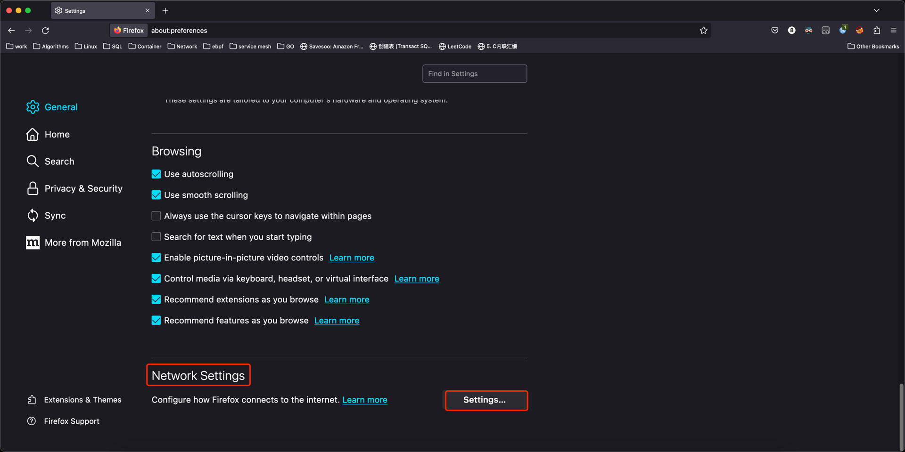
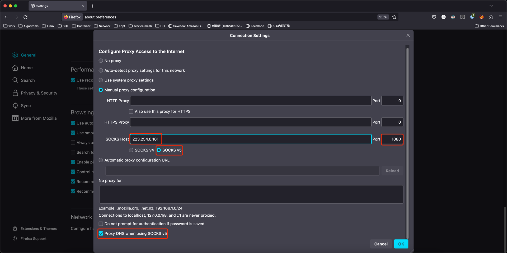
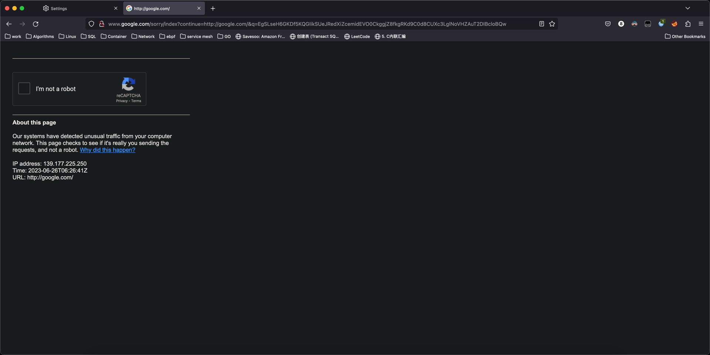
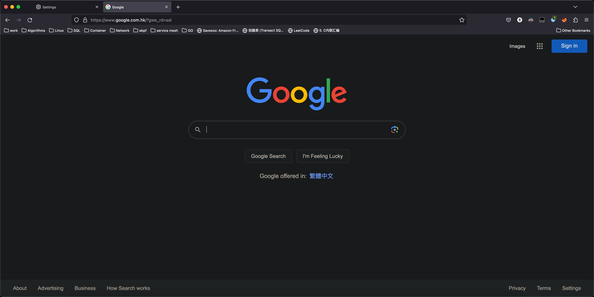

## 使用场景

- 公司的电脑可以上外网
- 家里的电脑不可以上外网

## 诉求

家里的电脑也可以上外网

## 材料

- 一个公网的 k8s 集群
- 家里的电脑安装 Firefox

```json
{ "kind": "Config", "apiVersion": "v1", "preferences": {}, "clusters": [ { "name": "ccdpol3fqtofinnpvv720", "cluster": { "server": "https://180.184.83.249:6443", "certificate-authority-data": "LS0tLS1CRUdJTiBDRVJUSUZJQ0FURS0tLS0tCk1JSUM2akNDQWRLZ0F3SUJBZ0lCQURBTkJna3Foa2lHOXcwQkFRc0ZBREFWTVJNd0VRWURWUVFERXdwcmRXSmwKY201bGRHVnpNQjRYRFRJeU1URXhOVEV5TkRRMU1Gb1hEVE15TVRFeE1qRXlORGsxTUZvd0ZURVRNQkVHQTFVRQpBeE1LYTNWaVpYSnVaWFJsY3pDQ0FTSXdEUVlKS29aSWh2Y05BUUVCQlFBRGdnRVBBRENDQVFvQ2dnRUJBTVoxCk1MY0NLcTN6Rys5VDVNNml1MExqRkhqT1QyVFBQMHQ4RkFUR1hIZytSN1hEdnY3cmsvZWYwNDRlSStEeXJqY2kKV1ZmakZ1emUxRDh0SG5mSXJpWDd6RmVWRWpja1ZjMmNMRDE0NzlobERwOFQvVjlweVV1WFZ1VUNta0RaSmxYbApMOFJxM2VieFZ5RlZUai8vaUZiSWhQTFc1WWpaSXZMUElZcXhsek9BSmRLMlc5QlVuOEE2VE5ueHRRcjZHckFyCnB6dyswaWNBUWNTbGlmckhJZ1VtMnB6UHZsMG1oZTVwU2ZlbURlaktoaVBDTkxBL3Blc1o4RFpwVHpJRGRpMnoKTWVVMFh3K2hyUVBwbXNlSzNyLzJUNnk1YzZ4N010MXBkMmpxZW1CL2lhdXhVcTgyeWVFbWh0aVVtMjJqbWxGSgpseGhqaWZ5emxWOHFRa0VzTGtNQ0F3RUFBYU5GTUVNd0RnWURWUjBQQVFIL0JBUURBZ0trTUJJR0ExVWRFd0VCCi93UUlNQVlCQWY4Q0FRQXdIUVlEVlIwT0JCWUVGSWlDaFVhOVUyZ2NrdnFZU0xKWDcxTlRNNUF6TUEwR0NTcUcKU0liM0RRRUJDd1VBQTRJQkFRQXdiRmJ1MEFxd0tvQ1F4eDB2NVVaUm1PSlBwdkNpWFRhNUEzeHZoTURJdnVZLwpsTGp6WHBjS2IzTWhhRWZRczNSeFVVSTg1QUlhMStSUkFNRDRiRVVidlRveGt5VGtLeUMyR20wd0pnSEZFU3M5CjV0ZnZoMHJoL1RQeXYrdlNCam1wbW84RGhNQXI1NGl4SGRST0tPc1IxR1o0UWRzdHlnY1RHSmQ5NFFpalJETnEKa2FvQ3k1ZDA5NWZHRHc0NTlKaXdHWEFGYlllNzZRdHVWNzkyOVp0eEhzdytBTmVFNzdzbTNaOG1YRTJSamt0aAo0U1NsR3pwZmtFSTNIcDQza0xBd1ppNlBqdnhzNzQ4NVl5bVo2SFFRL3NBbzY3TUl0czZWOCtGdjdLUUUzSGpwCjJFQUdhUkxNaVFuMmJ0WVVXQ2VPNzdFbWh1T0lJU3U1U2U0L3lxWWIKLS0tLS1FTkQgQ0VSVElGSUNBVEUtLS0tLQo=" } } ], "users": [ { "name": "1263658", "user": { "client-certificate-data": "LS0tLS1CRUdJTiBDRVJUSUZJQ0FURS0tLS0tCk1JSUM4VENDQWRtZ0F3SUJBZ0lJZmRWd0lRNkxMdmd3RFFZSktvWklodmNOQVFFTEJRQXdGVEVUTUJFR0ExVUUKQXhNS2EzVmlaWEp1WlhSbGN6QWVGdzB5TWpFeE1UVXhNalEwTlRCYUZ3MHpNakV4TWpJd09EVTVOVEZhTUJJeApFREFPQmdOVkJBTVRCekV5TmpNMk5UZ3dnZ0VpTUEwR0NTcUdTSWIzRFFFQkFRVUFBNElCRHdBd2dnRUtBb0lCCkFRREUveEFLK2x6eTJXeldTcVAyV3R3b1h6TGtPL3JmTkF5b2dWeWRPOGgzNmx3NWVCS0NrMjY1aHRuQkNvWloKNWc0Mml0V3lrTWdDNy9SS3hpQTRFU2pJTDcwLzgwZ0hNTU90MXdNVDZqc2VWMlJoVTFXYkhCcUtPSmFBODVMYwpwcy85Q3ZCREFrWVREbjIrYjhQYVNRbjhybnY4cFBOc0FZVm9tSndnQmpoWnRpcXZtc05uVmdjdCtmR0tJbVdYCnlUVDY1T0oydFAxeHRud2hSWmhYNXBqd0JHMW10QWR0cWRFSTVWQTJzdkUrQy9zVENvaVc5UUFQM0dzeFRSdlAKZ1ZyN2FOVUFmQzR1b25TQUtJcytGWit1d09kWFdoYmpTbTBLZW1HU3pPRkdaRHEvUDNPUG0xWTBlMWp2d21IMApMVHl4a2ZJbkJuUWo4bEdabUxHUVhxd0ZBZ01CQUFHalNEQkdNQTRHQTFVZER3RUIvd1FFQXdJRm9EQVRCZ05WCkhTVUVEREFLQmdnckJnRUZCUWNEQWpBZkJnTlZIU01FR0RBV2dCU0lnb1ZHdlZOb0hKTDZtRWl5Vis5VFV6T1EKTXpBTkJna3Foa2lHOXcwQkFRc0ZBQU9DQVFFQVlLdVJXM2dMYXdMZk1pMUhkTEVKZTNuY2liUjNINDJOdDNtQgplZVIyNVhwNEpCUmwyM3ZqemJBSU5EOWduMGIwVlNxNjVPNGdSNmQzT1RCS01ITkwvMVp6encvQzBOU1R4ZTRxCjAyeEtiZENxUjljRjlDL3FxVHFPM3JPQVpyT1F2UlplTFhxNCtQa3Y3eGJsNlduMWRXaVpHeXlVcEwxVmFnb2sKcjJENWlQS1hJb1gvc3kxUWl5UGJKMTRSdndJVi8rRmJhcnIxMzVCZkxkNTNJa1MyVG40U2NPczUwSjBlNzlnYwpsR1FnbXdhcm5wcVFOZVVGVXo0QU5MSXdWc1IrcS9XQ0Y4WDRnVnl6K3NraDN6NFZTcGtFZGJ5czNRT0dLZEwvCituTjJlcDRVc09vekdqaHpSQm4xVWVBUjBNQ05tM1crVFhxeFdhNVRGemZXc0tWaXdnPT0KLS0tLS1FTkQgQ0VSVElGSUNBVEUtLS0tLQo=", "client-key-data": "LS0tLS1CRUdJTiBSU0EgUFJJVkFURSBLRVktLS0tLQpNSUlFb3dJQkFBS0NBUUVBeFA4UUN2cGM4dGxzMWtxajlscmNLRjh5NUR2NjN6UU1xSUZjblR2SWQrcGNPWGdTCmdwTnV1WWJad1FxR1dlWU9Ob3JWc3BESUF1LzBTc1lnT0JFb3lDKzlQL05JQnpERHJkY0RFK283SGxka1lWTlYKbXh3YWlqaVdnUE9TM0tiUC9RcndRd0pHRXc1OXZtL0Qya2tKL0s1Ny9LVHpiQUdGYUppY0lBWTRXYllxcjVyRApaMVlITGZueGlpSmxsOGswK3VUaWRyVDljYlo4SVVXWVYrYVk4QVJ0WnJRSGJhblJDT1ZRTnJMeFBndjdFd3FJCmx2VUFEOXhyTVUwYno0RmErMmpWQUh3dUxxSjBnQ2lMUGhXZnJzRG5WMW9XNDBwdENucGhrc3poUm1RNnZ6OXoKajV0V05IdFk3OEpoOUMwOHNaSHlKd1owSS9KUm1aaXhrRjZzQlFJREFRQUJBb0lCQVFEQVNnUjc0c1NGM0V2TApwTklGTDgyRXJ1QTdQbnowRUpkbWg5ZENOMC9JRllCdUxGRk5HZUpUd0ZpZmdNbUJ5UGtJcmw1SHplRWVWT0VOCmQvV05KTnE5QlRSaXp2TDQ2ZFdudzUvaWVabTVWUzdMZlkrck56U0V4UlhMeTNZSVlkL1ZyUzYzQ2VvaXdkdGwKM3l5Nnp0NnJ3aG1Paytoei9jd2VQQkR4aFlETnR6ZnI2Yk5XUE81eEt3b0xyRjJ1MW1nMjlsbGZIVUIyTXJwVQpuNUhZeUNuQmxqMVJOQk02TTRzRHBZY0U2MlJZUk9YWmk1RU1tbVVoY0Jtc1M0ZXZRcEQxVGJUcy9HWnhVV2Y0Ck5ReityVGtqM2RYYStGMUN5czRmRDZzT2paRGZDbCtQbzNDYUdGejErWk1uTjd4dXpwUzdpcXloUElzbWtRVWYKUk83emlkeUZBb0dCQU9EYjBDS0hoVlpKUGdIa29tamh5SnVmZ2VVNTJYYWpIOUZvTWpldXpqRWZERzQ3TGpiSwp3b3pZbGdPTmd4UU5SRUpCRTBULzNRQkd6cG5hOXAxdjNrVnBrZDB4RnNvd2dWZGpiTzBxaHBXaWJXWS9Qb0xNClBYdTR6NExza0RpMU1aNzRGcVdXenpZSXpCU25pMWR1NFpKeVlGQVBaMEtsZDNhTDQ1VHB4bXpYQW9HQkFPQkgKYWRYbkRhd0J3dWdMVC92bDArRHFlaTJxY3QxbmlIaG9JSjRoaDZWU054OHFyMHpReE9MTHV1S3k5enU2QzU3SQpXUXpKNkRESXc5SGJIUHZSdTFPTTMvTi9WcVp6c2Zwc0RIb3hkNmxRNHFaMndQVGNlOWRjR3VOVW9pdTNWNDBECjVoOFVGd0hqTjdoVTNYeGs1SkJzTTEyQ2NoQTI3RHgrRnhWYmlaYURBb0dBYjRkWGt1alpEOVZBTmp3cStnNlQKSysxUHhseU5LalQ2d1NrSFQyc2F4bTU2QWVyRW4xU3VicUcydG9ob0xYZnZGVldsc3lHZGdsZWNmZCtIVnN0MwoyY0hsSVdzSnZMdVdTN3Y2K1IrUXBZTnM4N3dHeTJWMlVYbDNJNThtWVpvdHhJV1U1Z2tKT2VuZkg1ZUNtNWxaCnRRT2FGZHV1QWZhRWJINHlJVmhhblAwQ2dZQVBXOVNibVY4T1VIQ1FnM1hPd2tab09LWjFTaDdqbXB0MTQydVkKYUtOcFp0L3ZlblRXeGRVMTBzM1JpSC8xengvTWw5dkJUSEppSk4yRUdZVTZtWHBDbG5zZnFiQzlaVjdpejFOcgphc2ZQQ0lMODgxVHpiOFhyVVp0bHhmMzFFSEVtYndYclN1em9iQzc4cUpNaVdhWnRYWHVIQTgvYjNHY0JIWUZuCkxRV1hFUUtCZ0E1RUFCOTNzVXVwdEtPeUdKS3F2c1VpT1RReWtKc3VqKzZyVG1DRjVQdUpENmt1aXRtZDBRRmUKaEM1VCtsdmhKejc1TThFclZDRmp0UHlMeTBreURuRmcrcVphSlhhR3JEWnRYOVY4dk5OdlovaU16bGtuQnc4RQp3VnNZeXNmb3lhU0tlYWZqS2YxWjRybnd6djA4Z2kvMnQzQ1ZoSXRjek9la25UbHlEdE83Ci0tLS0tRU5EIFJTQSBQUklWQVRFIEtFWS0tLS0tCg==" } } ], "contexts": [ { "name": "ccdpol3fqtofinnpvv720@1263658", "context": { "cluster": "ccdpol3fqtofinnpvv720", "user": "1263658" } } ], "current-context": "ccdpol3fqtofinnpvv720@1263658" }
```

## 步骤

公司的电脑

```shell
# 使用 kubevpn 链接集群网络
kubevpn connect
```

```shell
# 本地启动一个 socks5 代理
docker run -d --name socks5 -p 1080:1080 serjs/go-socks5-proxy
```

```shell
# 获取由 KubeVPN 创建的内网 IP，记住这个 IP
ifconfig | grep 223.254 
	inet 223.254.0.101 --> 223.254.0.101 netmask 0xffff0000
```

家里的电脑

```shell
# 使用 kubevpn 链接集群网络
kubevpn connect
```

然后打开 Firefox 填写公司电脑的 socks5 信息，```223.254.0.101:1080```




配置完成后，就可以打开 https://www.google.com 了，只有 Firefox 可以上外网，别的浏览器不影响




