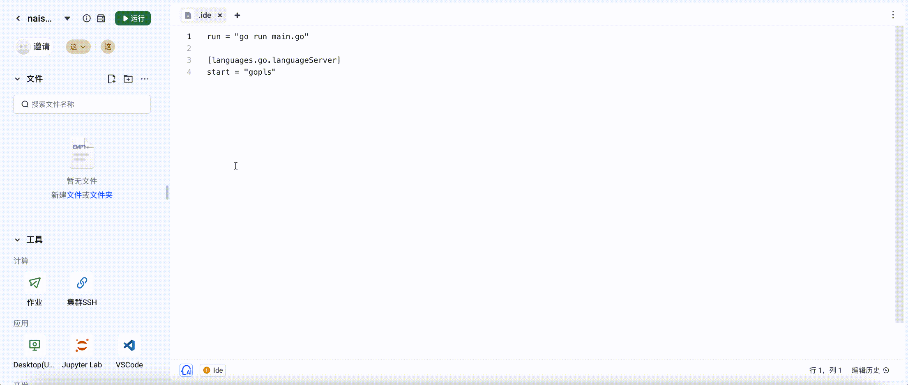

# 代码运行

# 引言

## 背景

在 WebIDE 中，我们使用到了 [nixpkgs](https://github.com/NixOS/nixpkgs)
这个软件包来安装和提供运行环境。因此，如果我们想要自定义自己的开发环境，那么可以使用如下模版，进行配置。

## 目标

用户自定义开发环境需要的包，代码运行可以使用这些定义的包，去运行用户编写的代码，并且将输入输出显示在 console 中。

## 基础能力

## 高级能力

## 需求分析

这里有个声明式开发环境的概念，那就是在进入工作空间后，用户如果想使用 `go` 或者 `python` 或者 `go/python`
的不同版本，都需要能够支持。如果提前将各种开发语言都安装在基础镜像中，则无法做到动态的效果。因此在调研了 [replit](https://replit.com)
的实现方式后。我们决定采用 [nixpkgs](https://github.com/NixOS/nixpkgs)，作为声明式开发环境的基础。
比如，执行如下命令，就可以得到一个 `go` 的环境：

```shell
nix-shell -p go
```

```shell
runner@ws-cpa2ku5ni3eaveqd8g30-86c9f6d57c-xbbbb:~$ nix-shell -p go

[nix-shell:~]$ go version
go version go1.22.2 linux/amd64

[nix-shell:~]$
```

# 技术设计

## 架构设计


## 详细设计

新增配置:

```toml
run = go run main.go
```

```shell
unshare --uts --cgroup --user --ipc --mount --pid --map-user 1000 --map-group 12179 --fork --kill-child --propagation private --mount-proc nix-shell /home/runner/code/.ide.nix --run go run main.go
```

将输入和输出写到对应的 Pipe 中即可。

## 镜像

```dockerfile
FROM debian:latest
RUN sed -i 's/deb.debian.org/mirrors.tuna.tsinghua.edu.cn/g' /etc/apt/sources.list
RUN apt update \
     && apt install -y --no-install-recommends locales xz-utils curl lsof shellcheck iptables \
     && apt clean \
     && rm -rf /var/lib/apt/lists/*
ARG TARGETOS
ARG TARGETARCH
ENV LANG=C.UTF-8
RUN locale-gen
ENV LC_ALL=C.UTF-8

RUN groupadd runner -g 1000 && useradd runner -u 1000 -g 1000
RUN mkdir -m 0755 /nix && chown runner /nix
RUN mkdir -m 0755 /etc/nix && chown runner /etc/nix
USER runner
WORKDIR /home/runner
RUN curl -L https://mirrors.tuna.tsinghua.edu.cn/nix/latest/install | sh

WORKDIR /app
COPY build/server/default.nix default.nix

RUN echo 'substituters = https://mirrors.bfsu.edu.cn/nix-channels/store https://mirrors.tuna.tsinghua.edu.cn/nix-channels/store https://mirrors.ustc.edu.cn/nix-channels/store https://cache.nixos.org' >> /etc/nix/nix.conf

ENV PATH=/home/runner/.nix-profile/bin:/home/runner/.nix-profile/sbin:$PATH

RUN nix-channel --add https://mirrors.tuna.tsinghua.edu.cn/nix-channels/nixpkgs-unstable nixpkgs \
    && nix-channel --add https://mirrors.bfsu.edu.cn/nix-channels/nixpkgs-unstable nixpkgs \
    && nix-channel --update \
    && nix-env -if /app/default.nix \
    && nix-shell /app/default.nix --run 'pip install wdl-lsp --break-system-packages --user -i https://pypi.tuna.tsinghua.edu.cn/simple'

USER root

COPY build/server/debugger /debugger
RUN chown -R 1000:1000 /debugger

ADD https://github.com/fpco/pid1-rs/releases/download/v0.1.3/pid1-x86_64-unknown-linux-musl /usr/bin/pid1
RUN chmod +x /usr/bin/pid1

# install rfbproxy for visible output
RUN apt update \
     && apt install -y libpulse-dev libopus-dev libmp3lame-dev xz-utils \
     && apt clean \
     && rm -rf /var/lib/apt/lists/*
RUN wget https://github.com/replit/rfbproxy/releases/download/0.1.0/rfbproxy.tar.xz && tar xf rfbproxy.tar.xz -C /
```

## 效果演示

