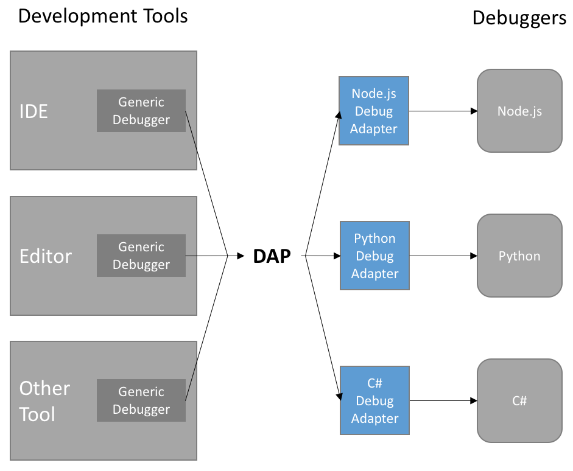

# 代码调试

# 引言

## 背景

工作空间的集成开发环境（IDE），将帮助用户更好地编辑、调试和运行代码。Replit的调试器工具是其中之一，用于帮助开发人员在调试代码时定位和解决问题。
调试器工具允许您在程序执行期间逐行查看代码，并提供有关变量值、函数调用和程序状态的实时信息。您可以设置断点，使程序在特定位置停止执行，以便您可以检查变量的值和代码的执行路径。
在Debug场景下，用户可以：

1. 设置和管理断点：您可以在代码中设置断点，使程序在特定位置停止执行，以便您可以检查代码和变量的状态。
2. 单步执行代码：您可以逐行执行程序，从而了解每一步的执行情况。
3. 查看变量：您可以查看变量的当前值，并在每一步中跟踪其变化。
4. 监视函数调用：您可以查看函数的调用堆栈，了解函数是如何一步步被调用和执行的。
   通过使用调试器工具，开发人员可以更轻松地识别和修复代码中的错误和问题，提高代码质量和调试效率。

## 目标

## 基础能力

## 高级能力

## 需求分析

1. 设置断点
   在代码调试过程中，设置断点是一种常用的技术，用于指示程序在特定位置暂停执行，以便开发人员可以检查程序的状态、变量的值和执行路径。断点的设置不会影响程序在正常运行时的执行，只在调试过程中起作用。
   对于配置了[debugger] support = true的工作空间（参考第三点-Debugger配置），用户可以在编辑器中对配置文件中[language]
   支持的文件设置/取消设置断点。

- 设置断点：在希望设置断点的代码行左侧单击行号。通常，行号旁边会显示一个红色的圆点或其他标记，表示断点已经设置成功。
- 取消断点：在已设置断点的代码行左侧单击行号。这将取消该行上的断点。断点标记通常会从行号旁边消失，表示断点已经取消设置。
  备选方案
  假如通过配置来判断当前文件是否允许设置断点不好实现，也可以一律开放断点设置，只不过调试时永远不会走到这个断点。
  当程序执行到设置的断点位置时，调试器会暂停程序的执行，并提供一个调试界面，显示当前断点处的变量值和程序的状态，而无需用户在代码中插入打印或日志语句。

1. Debug
   在Debugger工具窗口中，将展示以下信息：

- 所用调试器：展示在配置文件中配的调试器（不一定要有，vscode中就未展示）
- 操作项：调试/停止、单步执行、跳过执行、下一个断点
    - 调试/停止
      在调试过程中，当设置了断点后，可以通过调试器面板中的调试按钮来启动调试运行。调试器会运行程序，直到达到第一个设置的断点位置，然后暂停程序的执行，以便进行检查和调试。程序暂停后，工作空间将自动打开断点所在的文件，并高亮当前执行到的断点所在行。
      调试运行的时候，调试按钮会变成停止按钮，用户点击停止本次调试。
    - 单步执行（Next Step）
      单步执行是调试过程中的一项常用功能，它允许开发人员逐行或逐步执行程序，以便观察程序的执行路径和状态。用户点击「单步执行」
      按钮后，程序将前进到下一个可能停止执行的代码行。
      在调试过程中，「单步执行」允许开发人员逐行执行程序。每次点击
      「单步执行」，程序将前进到下一行代码，并在该行暂停执行，以便开发人员检查变量和程序状态。如果当前行调用了一个函数，「单步执行」将使程序进入该函数内部，以便逐步执行函数内部的代码。这样，开发人员可以跟踪函数的执行路径和观察函数内部的变量值。当程序执行到一个函数的最后一行时，「单步执行」将使程序返回到调用该函数的位置。从这个位置继续执行后续的代码。
    - 跳过执行（Skip Step）
      用户点击「跳过执行」按钮后，如果当前要执行的行是函数调用，则不进入该函数，而是直接执行下一行代码。
    - 下一个断点（Next Breakpoint）
      用户点击「下一个断点」按钮后，程序将直接运行到下一个断点。
- 断点：列表展示工作空间中所有断点，展示内容包括断点所在文件和所在行数，点击可以自动打开对应文件并高亮对应行数
- 变量：展示当前断点处的变量值。包括
    - 局部变量（Local Variables）：这些是在当前作用域内定义的变量。在调试器中，你可以查看这些变量的名称和值，以及在断点位置之前的代码行中定义的局部变量的值。
    - 全局变量（Global Variables）：这些是在全局范围内定义的变量，可以在程序的任何地方访问。在调试器中，你可以查看全局变量的名称和值。
    - 参数变量（Function Parameters）：这些是函数定义中声明的参数，在函数调用过程中传递给函数的值。在调试器中，你可以查看函数的参数名称和传递给函数的值。
    - 类成员变量（Class Member Variables）：对于面向对象的编程语言，类成员变量是在类定义中声明的变量。在调试器中，你可以查看类的实例的成员变量的名称和值。
      变量类型可能取决于所使用的编程语言和调试器，可以根据技术方案讨论和调整。
- 调用堆栈：
    - 调用堆栈是一个记录了当前程序执行路径的数据结构，它记录了程序中每个函数的调用关系。
    - 调用堆栈显示了程序执行到当前断点位置的函数调用链。每个函数调用都在堆栈中表示为一个帧（Frame），包含了函数名称、所在文件和行号等信息。堆栈的顶部是当前断点所在的函数，而底部是最初的调用点。
    - 通过查看调用堆栈，你可以追踪程序的函数调用路径，了解函数是如何相互调用的。这对于理解程序的逻辑流程、查找问题所在以及调试代码非常有用。
    - 假如点击的帧是工作空间内用户自己写的代码，则会跳转到对应的文件高亮对应的行数。如果点击的是builtin函数，则点击后则可以不跳转（参考replit
      [Image]
- 以上所提到的断点、变量、调用堆栈三个模块如果内容为空，则直接隐藏。

三、Debugger配置
为了能debug代码，就要解决三个问题：

- 不同的代码需要不同的调试器，怎么进行统一？DAP？
- 何时以及如何安装这些调试器？
- 怎么配置这些调试器的参数？
  我们可以用类似replit的方式使用.config来定义调试器的运行命令和参数，并且通过.nix来自动化安装调试器，具体可以根据技术方案调整。
  调试配置需要研发同学进一步调研，Replit的方案仅供参考，它目前只支持几款预研的调试，我们希望能做的比Replit更通用。产品层面的诉求是用户可以通过编辑配置文件
  自定义调试器、初始化命令和参数、启动命令和参数，并且在点击调试后自动安装并能够正常运行上述调试功能。
- 易用性：通过编辑配置文件即可根据项目的要求进行灵活的配置。
- 通用性：能够支持未来别的编程语言的调试，如Go, Java, NodeJS等。
- 自动化：用户不需要手动处理调试器安装的步骤，系统能够自动安装用户指定的调试器。

[DAP spec](https://microsoft.github.io/debug-adapter-protocol/)

# 技术设计

## 架构设计

## 详细设计

| 语言     | 调试器          | 调试命令                                                                                                                                                                                                                                                      |
|:-------|:-------------|:----------------------------------------------------------------------------------------------------------------------------------------------------------------------------------------------------------------------------------------------------------|
| Go     | dlv          | dlv --listen=localhost:4000 --headless=true --api-version=2 --check-go-version=false --only-same-user=false exec /tmp/main                                                                                                                                |
| Python | debugpy      | PYTHONUNBUFFERED=1 python3 -m debugpy --listen localhost:4000 --wait-for-client                                                                                                                                                                           |
| C      | OpenDebugAD7 | gcc -g -O0 -o /tmp/main %s && /debugger/cppdap/bin/OpenDebugAD7 --server=4000 --trace=response                                                                                                                                                            |
| C++    | OpenDebugAD7 | g++ -g -O0 -o /tmp/main %s && /debugger/cppdap/bin/OpenDebugAD7 --server=4000 --trace=response                                                                                                                                                            |
| Java   | jdtls        | python3 /debugger/java/start.py --language-server /debugger/java/start.sh --debug-plugin /debugger/java/com.microsoft.java.debug.plugin-0.51.1.jar  child: java -agentlib:jdwp=transport=dt_socket,server=y,suspend=y,address=localhost:4000 -cp /tmp |
