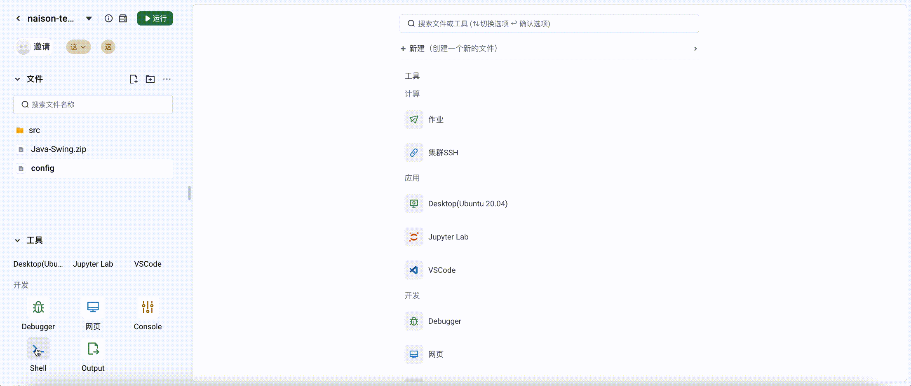

# Shell 工具

# 引言

## 背景

## 目标

进入工作空间所在 Pod ，运行各种终端命令，如管理项目依赖，执行脚本或程序，或是使用文本编辑器等。

## 基础能力

- 以固定用户如 runner
  免密登录工作空间Pod，登录后将进入工作空间目录/home/runner/code。Shell的PS1只展示当前所在路径，如/home/runner/code $
- 访问文件：用户可以访问当前工作空间目录下的所有文件。
- 执行命令：用户可以在Shell中执行命令。
- 禁止所有用户切换到root用户或sudo

## 高级能力

- 使用 linux namespace 隔离
- 屏蔽敏感环境变量

## 需求分析

本质是个 web shell，会涉及两个接口，一个新建 terminal，另一个是 resize terminal。
新建 terminal 使用 pty 启动一个 terminal。resize 是重置窗口的大小。
使用一条链接，同时处理数据流和resize流

# 技术设计

- 使用 linux namespace 隔离，可以实现进程隔离。防止用户看到其它不必要的进程。
- 使用设置权限，使得用户只能操作自己的工作空间
- 移除 k8s pod 的环境变量

## 架构设计


## 详细设计

```shell
unshare --uts --map-user 1000 --map-group 12284 --pid --mount --fork --mount-proc pid1 nix-shell /app/code/.ide.nix
```

```text
SecurityContext: &corev1.SecurityContext{
   RunAsUser:  pointer.Int64(0),
   RunAsGroup: pointer.Int64(0),
   Privileged: pointer.Bool(true),
   Capabilities: &corev1.Capabilities{
      Add: []corev1.Capability{
         "SYS_MODULE",
      },
   },
}
```

## 效果演示

