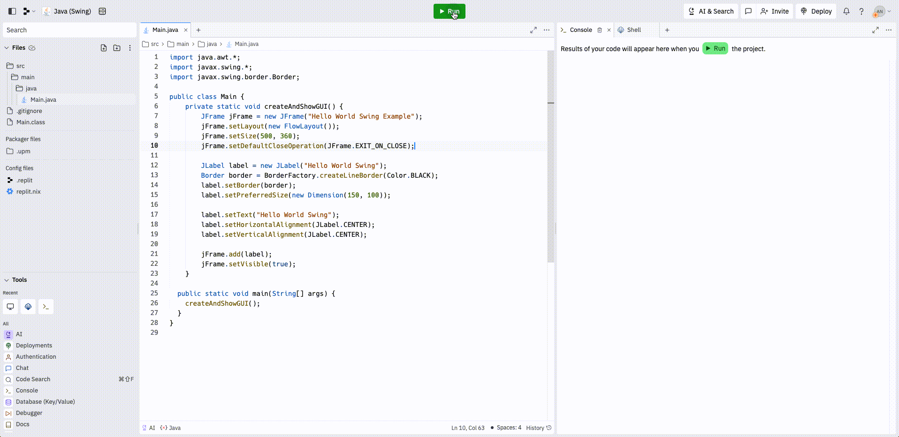
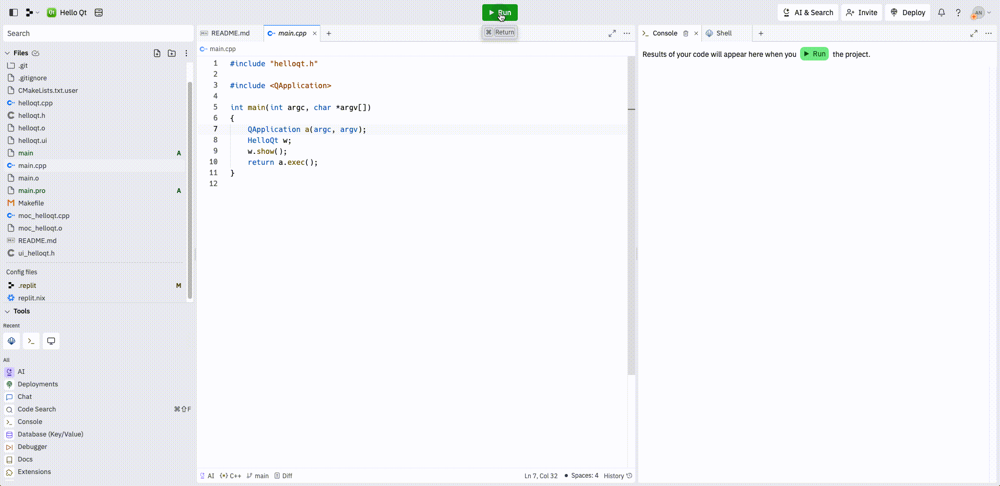
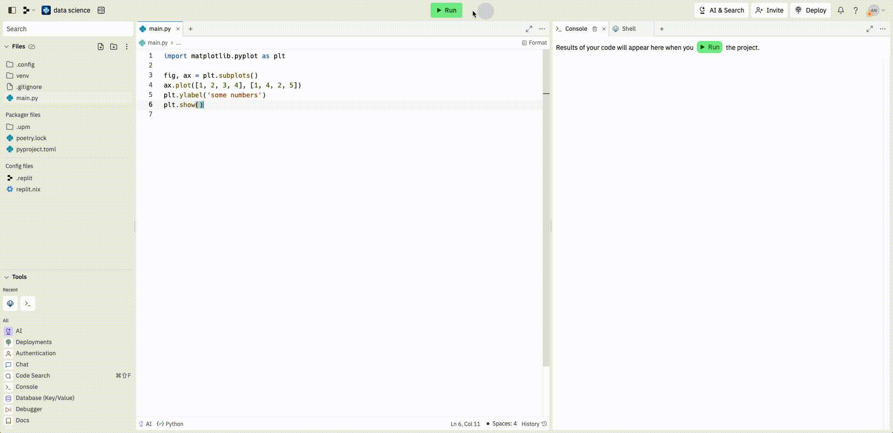
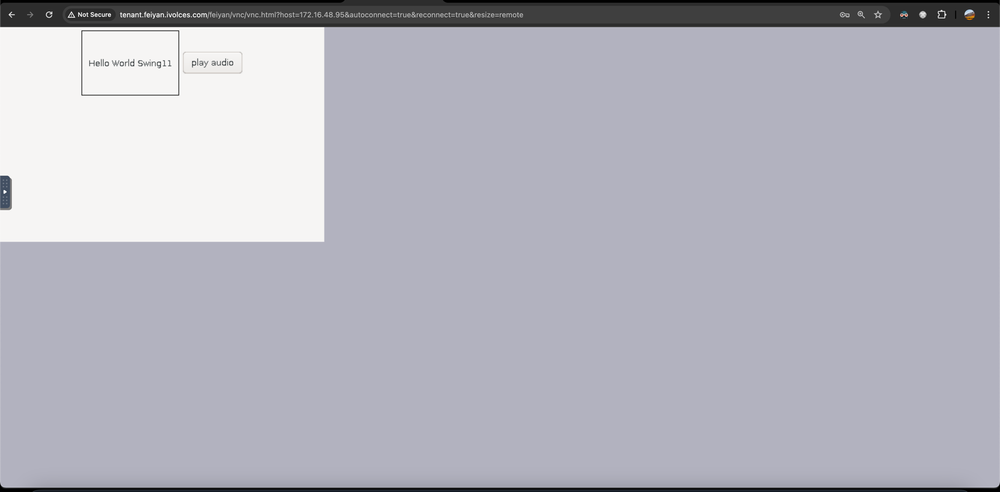
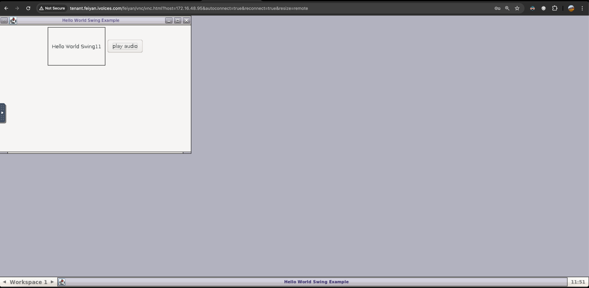
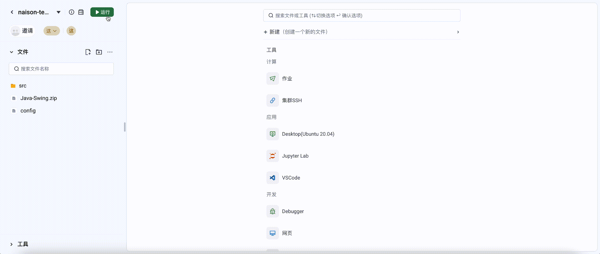

# 可视化输出(Visible Output)

# 引言

## 背景

目前的 console 只能显示文字。接到需求，需要能够在 Cloud IDE 中显示 GUI 程序，比如桌面程序，或者输出一张图片，需要能够显示出来。

## 目标

能够显示图形化窗口，用于开发桌面软件。

## 基础能力

点击运行后，自动打开 Output 工具，显示图形化页面，并且 console 中会显示错误日志。

当用户点击运行后，系统如果检测到有图形输出，则自动打开Output工具。Output工具需要能：

- 展示图形输出窗口
- 能接收用户键盘输入
- 能鼠标操作窗口，如调整窗口大小、移动窗口

## 高级能力

支持拖拽，交互能力，并且支持播放语音。如果桌面程序运行后会播放声音的话。支持多人连接。状态共享。

三、协同

- 一旦工作空间内有一个协作者运行了一个GUI，那么所有协作者都会自动打开Output工具。如果进入前其他协作者已经运行起来GUI，那么协作者进入后，空间内将自动打开Output工具
- 所有协作者看到的Output画面都一致，包括鼠标位置也是一样的。如果多人同时移动鼠标如何解决冲突，可以根据技术方案来定。

## 需求分析

借鉴，[replit](https://docs.replit.com/additional-resources/streaming-native-graphics-vnc) 的实现




需要使用到

- [tigervnc](https://github.com/TigerVNC/tigervnc)
- [rfbproxy](https://github.com/replit/rfbproxy)
- [fluxbox](https://github.com/fluxbox/fluxbox)

# 技术设计

## 架构设计


## 详细设计

```text
let
  pkgs = import <nixpkgs> {};
in

pkgs.mkShell {
  buildInputs = with pkgs; [
    tigervnc
    fluxbox
  ];
   shellHook = ''
      export DISPLAY=:1
   '';
}
```

```shell
Xvnc -rfbport=5901 -SecurityTypes=None -BlacklistTimeout=0 -BlacklistThreshold=1000000000 -geometry 800x600 -localhost :1
```

```shell
RUST_LOG=debug rfbproxy --rfb-server=0.0.0.0:5901 
```

```shell
fluxbox
```

然后使用 novnc 链接

```text
http://tenant.feiyan.ivolces.com/feiyan/vnc/vnc.html?host=172.16.48.44&autoconnect=true&reconnect=true&resize=remote
```





因此，后端会出个 websocket 接口。连接到 ide-server 的 screen 1 上

```go
package http

import (
	"fmt"
	"net/http"
	"net/http/httputil"
	"net/url"
)

func OutputHandler(w http.ResponseWriter, r *http.Request) {
	u, err := url.Parse(fmt.Sprintf("http://localhost:%d", 5900))
	if err != nil {
		http.Error(w, err.Error(), http.StatusInternalServerError)
		return
	}
	proxy := httputil.NewSingleHostReverseProxy(u)
	director := proxy.Director
	proxy.Director = func(req *http.Request) {
		director(req)
	}
	proxy.ServeHTTP(w, r)
}
```

## 效果演示

