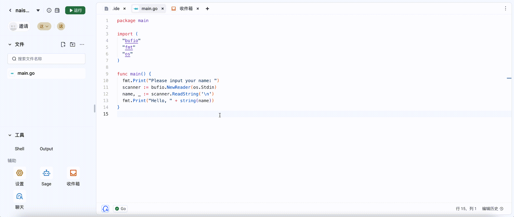

# 代码评论

# 引言

## 背景

Cloud IDE 支持代码评论功能

## 目标

用户可以在 Cloud IDE 中选中一段文字，然后进行评论。选中的段文字，用户可以继续编辑，新增，则选中的文字会相应变大。删除，选中的文字会对应缩小。当选中的问题都被删除，则评论消失。

## 基础能力

能实现单个用户的评论，对评论内容进行回复。

## 高级能力

多个用户可以同时编辑同一个评论选中的文字，做到对选中的文字也是协同的。多个人对评论进行回复。
多个人对于同一个选中的文字进行回复，则形成一个评论串。

## 需求分析

本质上这里涉及两个需求点。

- 评论：选中一段文字进行评论。
- 回复：对评论进行回复。

# 技术设计

## 架构设计

计算评论的左右指针位置。也就是评论起始位置和评论终止位置。在这里简化为计算评论起始位置和评论长度。

## 详细设计

逻辑整理
删除统称为向前删除，不是向后删除。

- 在评论中间新增 --> 评论涨大
- 在评论中间删除 --> 评论缩小 --> 减少为0（评论消失）
- 在评论中间删除 --> 跨越左边界
- 在评论前新增 --> 评论向后移动
- 在评论前删除 --> 评论向前移动
- 在评论后删除 --> 跨越右边界 --> 跨越左边界 --> 减少为0（评论消失）
- 在评论后新增 --> 评论不动
- 在评论后删除 --> 评论不动

粘连效果

- 在评论左边界新增，评论不变。
- 在评论右边界新增，评论变大。（和飞书保持一致）

## 可运维性

- 当代码文件移动位置或者重命名时，评论和回复依旧有效。
- 当代码文件被删除时，评论和回复均删除。
- 当工作空间被删除时，评论和回复均删除。

## 效果演示

