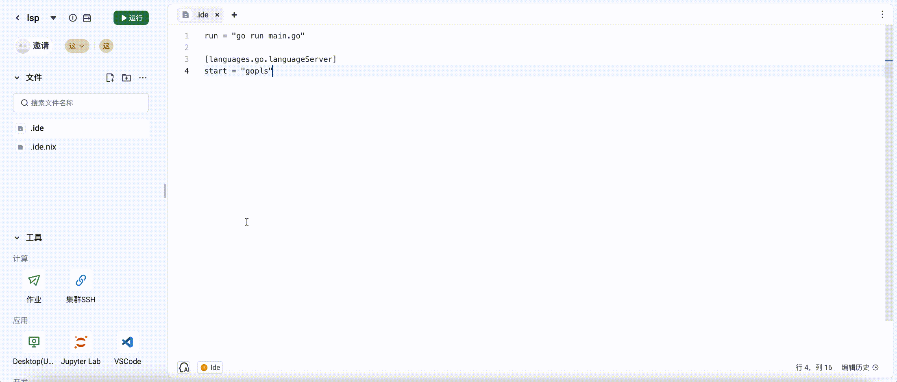

# 通用语言服务 LSP

# 引言

## 背景

通过与Language Server Protocol（LSP）的集成，为用户提供更智能、更便捷的开发体验。

## 目标

能够实现通用的 LSP ，支持所有语言的 LSP 能力.
LSP能力：代码补全、代码导航、重命名符号、代码错误与警告、文档和注释、句法高亮...

## 基础能力

将常用的 java，go，python，c，c++ 的LSP 内置在基础镜像中。

## 高级能力

任意类型的语言，可以通过配置，实现 LSP 的功能。

## 需求分析

[LSP spec](https://microsoft.github.io/language-server-protocol/)

# 技术设计

## 架构设计


## 详细设计

由于 LSP 默认使用 stdio 方式交互，虽然极个别支持 socket，tcp/websocket 等，方式交互，但默认是 stdio，因此我们需要对接 stdio
方式的 LSP。例如：

```shell
➜  ~ echo -ne 'Content-Length: 5715\r\n\r\n{"jsonrpc":"2.0","id":0,"method":"initialize","params":{"processId":null,"clientInfo":{"name":"Code - OSS Dev","version":"1.83.0"},"locale":"en","rootPath":null,"rootUri":null,"capabilities":{"workspace":{"applyEdit":true,"workspaceEdit":{"documentChanges":true,"resourceOperations":["create","rename","delete"],"failureHandling":"textOnlyTransactional","normalizesLineEndings":true,"changeAnnotationSupport":{"groupsOnLabel":true}},"configuration":true,"didChangeWatchedFiles":{"dynamicRegistration":true,"relativePatternSupport":true},"symbol":{"dynamicRegistration":true,"symbolKind":{"valueSet":[1,2,3,4,5,6,7,8,9,10,11,12,13,14,15,16,17,18,19,20,21,22,23,24,25,26]},"tagSupport":{"valueSet":[1]},"resolveSupport":{"properties":["location.range"]}},"codeLens":{"refreshSupport":true},"executeCommand":{"dynamicRegistration":true},"didChangeConfiguration":{"dynamicRegistration":true},"workspaceFolders":true,"semanticTokens":{"refreshSupport":true},"fileOperations":{"dynamicRegistration":true,"didCreate":true,"didRename":true,"didDelete":true,"willCreate":true,"willRename":true,"willDelete":true},"inlineValue":{"refreshSupport":true},"inlayHint":{"refreshSupport":true},"diagnostics":{"refreshSupport":true}},"textDocument":{"publishDiagnostics":{"relatedInformation":true,"versionSupport":false,"tagSupport":{"valueSet":[1,2]},"codeDescriptionSupport":true,"dataSupport":true},"synchronization":{"dynamicRegistration":true,"willSave":true,"willSaveWaitUntil":true,"didSave":true},"completion":{"dynamicRegistration":true,"contextSupport":true,"completionItem":{"snippetSupport":true,"commitCharactersSupport":true,"documentationFormat":["markdown","plaintext"],"deprecatedSupport":true,"preselectSupport":true,"tagSupport":{"valueSet":[1]},"insertReplaceSupport":true,"resolveSupport":{"properties":["documentation","detail","additionalTextEdits"]},"insertTextModeSupport":{"valueSet":[1,2]},"labelDetailsSupport":true},"insertTextMode":2,"completionItemKind":{"valueSet":[1,2,3,4,5,6,7,8,9,10,11,12,13,14,15,16,17,18,19,20,21,22,23,24,25]},"completionList":{"itemDefaults":["commitCharacters","editRange","insertTextFormat","insertTextMode"]}},"hover":{"dynamicRegistration":true,"contentFormat":["markdown","plaintext"]},"signatureHelp":{"dynamicRegistration":true,"signatureInformation":{"documentationFormat":["markdown","plaintext"],"parameterInformation":{"labelOffsetSupport":true},"activeParameterSupport":true},"contextSupport":true},"definition":{"dynamicRegistration":true,"linkSupport":true},"references":{"dynamicRegistration":true},"documentHighlight":{"dynamicRegistration":true},"documentSymbol":{"dynamicRegistration":true,"symbolKind":{"valueSet":[1,2,3,4,5,6,7,8,9,10,11,12,13,14,15,16,17,18,19,20,21,22,23,24,25,26]},"hierarchicalDocumentSymbolSupport":true,"tagSupport":{"valueSet":[1]},"labelSupport":true},"codeAction":{"dynamicRegistration":true,"isPreferredSupport":true,"disabledSupport":true,"dataSupport":true,"resolveSupport":{"properties":["edit"]},"codeActionLiteralSupport":{"codeActionKind":{"valueSet":["","quickfix","refactor","refactor.extract","refactor.inline","refactor.rewrite","source","source.organizeImports"]}},"honorsChangeAnnotations":false},"codeLens":{"dynamicRegistration":true},"formatting":{"dynamicRegistration":true},"rangeFormatting":{"dynamicRegistration":true},"onTypeFormatting":{"dynamicRegistration":true},"rename":{"dynamicRegistration":true,"prepareSupport":true,"prepareSupportDefaultBehavior":1,"honorsChangeAnnotations":true},"documentLink":{"dynamicRegistration":true,"tooltipSupport":true},"typeDefinition":{"dynamicRegistration":true,"linkSupport":true},"implementation":{"dynamicRegistration":true,"linkSupport":true},"colorProvider":{"dynamicRegistration":true},"foldingRange":{"dynamicRegistration":true,"rangeLimit":5000,"lineFoldingOnly":true,"foldingRangeKind":{"valueSet":["comment","imports","region"]},"foldingRange":{"collapsedText":false}},"declaration":{"dynamicRegistration":true,"linkSupport":true},"selectionRange":{"dynamicRegistration":true},"callHierarchy":{"dynamicRegistration":true},"semanticTokens":{"dynamicRegistration":true,"tokenTypes":["namespace","type","class","enum","interface","struct","typeParameter","parameter","variable","property","enumMember","event","function","method","macro","keyword","modifier","comment","string","number","regexp","operator","decorator"],"tokenModifiers":["declaration","definition","readonly","static","deprecated","abstract","async","modification","documentation","defaultLibrary"],"formats":["relative"],"requests":{"range":true,"full":{"delta":true}},"multilineTokenSupport":false,"overlappingTokenSupport":false,"serverCancelSupport":true,"augmentsSyntaxTokens":true},"linkedEditingRange":{"dynamicRegistration":true},"typeHierarchy":{"dynamicRegistration":true},"inlineValue":{"dynamicRegistration":true},"inlayHint":{"dynamicRegistration":true,"resolveSupport":{"properties":["tooltip","textEdits","label.tooltip","label.location","label.command"]}},"diagnostic":{"dynamicRegistration":true,"relatedDocumentSupport":false}},"window":{"showMessage":{"me <....
Content-Length: 857
Content-Type: application/vscode-jsonrpc; charset=utf8

{"jsonrpc":"2.0","id":0,"result":{"capabilities":{"codeActionProvider":true,"codeLensProvider":{"resolveProvider":false},"completionProvider":{"resolveProvider":true,"triggerCharacters":["."]},"documentFormattingProvider":true,"documentHighlightProvider":true,"documentRangeFormattingProvider":true,"documentSymbolProvider":true,"definitionProvider":true,"executeCommandProvider":{"commands":[]},"hoverProvider":true,"referencesProvider":true,"renameProvider":true,"foldingRangeProvider":true,"signatureHelpProvider":{"triggerCharacters":["(",",","="]},"textDocumentSync":{"change":2,"save":{"includeText":true},"openClose":true},"notebookDocumentSync":{"notebookSelector":[{"cells":[{"language":"python"}]}]},"workspace":{"workspaceFolders":{"supported":true,"changeNotifications":true}},"experimental":{}},"serverInfo":{"name":"pylsp","version":"1.9.0"}}}%
```

```shell
echo -ne 'Content-Length: 5773\r\n\r\n{"jsonrpc":"2.0","id":0,"method":"initialize","params":{"processId":null,"clientInfo":{"name":"Code - OSS Dev","version":"1.83.0"},"locale":"zh_CN","rootPath":"/code","rootUri":"file:///code","capabilities":{"workspace":{"applyEdit":true,"workspaceEdit":{"documentChanges":true,"resourceOperations":["create","rename","delete"],"failureHandling":"textOnlyTransactional","normalizesLineEndings":true,"changeAnnotationSupport":{"groupsOnLabel":true}},"configuration":true,"didChangeWatchedFiles":{"dynamicRegistration":true,"relativePatternSupport":true},"symbol":{"dynamicRegistration":true,"symbolKind":{"valueSet":[1,2,3,4,5,6,7,8,9,10,11,12,13,14,15,16,17,18,19,20,21,22,23,24,25,26]},"tagSupport":{"valueSet":[1]},"resolveSupport":{"properties":["location.range"]}},"codeLens":{"refreshSupport":true},"executeCommand":{"dynamicRegistration":true},"didChangeConfiguration":{"dynamicRegistration":true},"foldingRange":{"refreshSupport":true},"semanticTokens":{"refreshSupport":true},"fileOperations":{"dynamicRegistration":true,"didCreate":true,"didRename":true,"didDelete":true,"willCreate":true,"willRename":true,"willDelete":true},"inlineValue":{"refreshSupport":true},"inlayHint":{"refreshSupport":true},"diagnostics":{"refreshSupport":true}},"textDocument":{"publishDiagnostics":{"relatedInformation":true,"versionSupport":false,"tagSupport":{"valueSet":[1,2]},"codeDescriptionSupport":true,"dataSupport":true},"synchronization":{"dynamicRegistration":true,"willSave":true,"willSaveWaitUntil":true,"didSave":true},"completion":{"dynamicRegistration":true,"contextSupport":true,"completionItem":{"snippetSupport":true,"commitCharactersSupport":true,"documentationFormat":["markdown","plaintext"],"deprecatedSupport":true,"preselectSupport":true,"tagSupport":{"valueSet":[1]},"insertReplaceSupport":true,"resolveSupport":{"properties":["documentation","detail","additionalTextEdits"]},"insertTextModeSupport":{"valueSet":[1,2]},"labelDetailsSupport":true},"insertTextMode":2,"completionItemKind":{"valueSet":[1,2,3,4,5,6,7,8,9,10,11,12,13,14,15,16,17,18,19,20,21,22,23,24,25]},"completionList":{"itemDefaults":["commitCharacters","editRange","insertTextFormat","insertTextMode","data"]}},"hover":{"dynamicRegistration":true,"contentFormat":["markdown","plaintext"]},"signatureHelp":{"dynamicRegistration":true,"signatureInformation":{"documentationFormat":["markdown","plaintext"],"parameterInformation":{"labelOffsetSupport":true},"activeParameterSupport":true},"contextSupport":true},"definition":{"dynamicRegistration":true,"linkSupport":true},"references":{"dynamicRegistration":true},"documentHighlight":{"dynamicRegistration":true},"documentSymbol":{"dynamicRegistration":true,"symbolKind":{"valueSet":[1,2,3,4,5,6,7,8,9,10,11,12,13,14,15,16,17,18,19,20,21,22,23,24,25,26]},"hierarchicalDocumentSymbolSupport":true,"tagSupport":{"valueSet":[1]},"labelSupport":true},"codeAction":{"dynamicRegistration":true,"isPreferredSupport":true,"disabledSupport":true,"dataSupport":true,"resolveSupport":{"properties":["edit"]},"codeActionLiteralSupport":{"codeActionKind":{"valueSet":["","quickfix","refactor","refactor.extract","refactor.inline","refactor.rewrite","source","source.organizeImports"]}},"honorsChangeAnnotations":true},"codeLens":{"dynamicRegistration":true},"formatting":{"dynamicRegistration":true},"rangeFormatting":{"dynamicRegistration":true,"rangesSupport":true},"onTypeFormatting":{"dynamicRegistration":true},"rename":{"dynamicRegistration":true,"prepareSupport":true,"prepareSupportDefaultBehavior":1,"honorsChangeAnnotations":true},"documentLink":{"dynamicRegistration":true,"tooltipSupport":true},"typeDefinition":{"dynamicRegistration":true,"linkSupport":true},"implementation":{"dynamicRegistration":true,"linkSupport":true},"colorProvider":{"dynamicRegistration":true},"foldingRange":{"dynamicRegistration":true,"rangeLimit":5000,"lineFoldingOnly":true,"foldingRangeKind":{"valueSet":["comment","imports","region"]},"foldingRange":{"collapsedText":false}},"declaration":{"dynamicRegistration":true,"linkSupport":true},"selectionRange":{"dynamicRegistration":true},"callHierarchy":{"dynamicRegistration":true},"semanticTokens":{"dynamicRegistration":true,"tokenTypes":["namespace","type","class","enum","interface","struct","typeParameter","parameter","variable","property","enumMember","event","function","method","macro","keyword","modifier","comment","string","number","regexp","operator","decorator"],"tokenModifiers":["declaration","definition","readonly","static","deprecated","abstract","async","modification","documentation","defaultLibrary"],"formats":["relative"],"requests":{"range":true,"full":{"delta":true}},"multilineTokenSupport":false,"overlappingTokenSupport":false,"serverCancelSupport":true,"augmentsSyntaxTokens":true},"linkedEditingRange":{"dynamicRegistration":true},"typeHierarchy":{"dynamicRegistration":true},"inlineValue":{"dynamicRegistration":true},"inlayHint":{"dynamicRegistration":true,"resolveSupport":{"properties":["tooltip","textEdits","label.tooltip","label.location","label.command"]}},"diagnostic":{"dynamicRegistration":true,"relatedDocumentSupport":false}},"window":{"showMessage":{"messageActionItem":{"additionalPropertiesSupport":true}},"showDocument":{"support":true},"workDoneProgress":true},"general":{"staleRequestSupport":{"cancel":true,"retryOnContentModified":["textDocument/semanticTokens/full","textDocument/semanticTokens/range","textDocument/semanticTokens/full/delta"]},"regularExpressions":{"engine":"ECMAScript","version":"ES2020"},"markdown":{"parser":"marked","version":"1.1.0"},"positionEncodings":["utf-16"]},"notebookDocument":{"synchronization":{"dynamicRegistration":true,"executionSummarySupport":true}}},"trace":"off","workspaceFolders":[{"uri":"file:///code","name":"/code"}]}}' | wdl-lsp
```

伪代码

```go
exec.commond("nix-shell", "/home/runner/code/.ide.nix", "--run","pylsp")
```

```toml
[languages.python.languageServer]
start = "pylsp"

[languages.java.languageServer]
start = "jdtls -data /tmp"

[languages.go.languageServer]
start = "gopls"

[languages.c.languageServer]
start = "ccls"

[languages.cpp.languageServer]
start = "ccls"

[languages.typescript.languageServer]
start = "typescript-language-server --stdio"

[languages.shell.languageServer]
start = "bash-language-server start"

[languages.wdl.languageServer]
start = "wdl-lsp"

[languages.html.languageServer]
start = "vscode-html-language-server --stdio"

[languages.css.languageServer]
start = "vscode-css-language-server --stdio"

[languages.less.languageServer]
start = "vscode-css-language-server --stdio"

[languages.sass.languageServer]
start = "vscode-css-language-server --stdio"

[languages.javascript.languageServer]
start = "typescript-language-server --stdio"

[languages.typescript.languageServer]
start = "typescript-language-server --stdio"

[languages.markdown.languageServer]
start = "vscode-markdown-language-server  --stdio"

[languages.eslint.languageServer]
start = "vscode-eslint-language-server --stdio"

[languages.json.languageServer]
start = "vscode-json-language-server --stdio"

[languages.r.languageServer]
start = "R --silent --slave --no-save --no-restore -e 'languageserver::run(debug = TRUE)'"
```

```shell
{pkgs ? import <nixpkgs> {}}:
pkgs.mkShell {
    buildInputs = with pkgs; [
        pkgs.jdt-language-server
        pkgs.python311Packages.python-lsp-server
        pkgs.gopls
        pkgs.ccls
        pkgs.go
        pkgs.nodePackages.typescript-language-server
        pkgs.nodePackages.bash-language-server
        pkgs.vscode-langservers-extracted
        pkgs.nodePackages.nodejs
        pkgs.nodePackages.typescript-language-server
        pkgs.R
        pkgs.rPackages.languageserver
  ];}
```

## 效果演示

