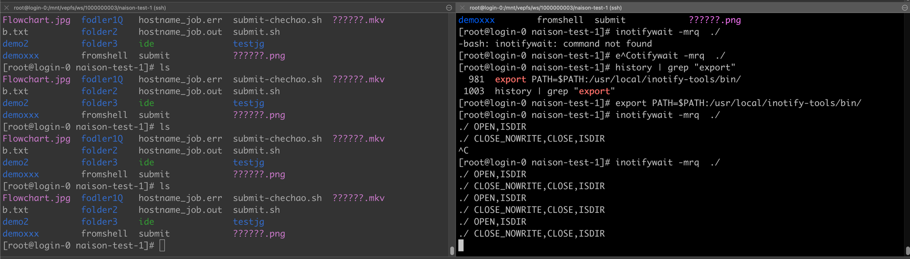
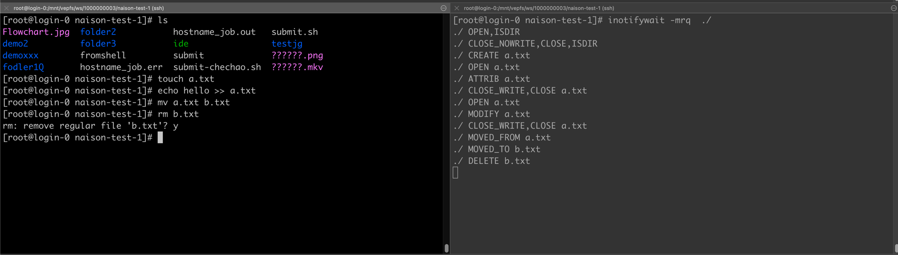

```text
       Inotify reports only events that a user-space program triggers
       through the filesystem API.  As a result, it does not catch
       remote events that occur on network filesystems.  (Applications
       must fall back to polling the filesystem to catch such events.)
       Furthermore, various pseudo-filesystems such as /proc, /sys, and
       /dev/pts are not monitorable with inotify.
```

https://man7.org/linux/man-pages/man7/inotify.7.html

## 后续

发现只要在一台主机上，被不同 namespace 访问，都是可以获取到事件的。所以需要将 pod 调度在同一个 node 即可

### 工具

- [Inotify-tools](https://docs.rockylinux.org/books/learning_rsync/06_rsync_inotify/)
- [启动 ns](https://www.nginx-cn.net/blog/what-are-namespaces-cgroups-how-do-they-work/)

### 遇到的问题

#### unshare failed: Invalid argument

在 redhat 系统中，或者 centos 系统中出现异常

```shell
[root@teja7131 ~]# unshare -U /bin/bash
unshare: unshare failed: Invalid argument
```

#### 解决方法

```shell
# cat /proc/sys/user/max_user_namespaces
0
# echo 640 > /proc/sys/user/max_user_namespaces
# unshare -U sh
sh-4.2$ 
```

#### 步骤1

```shell
[root@login-0 naison-test-1]# unshare --pid --mount-proc --fork bash
[root@login-0 naison-test-1]# ls
Flowchart.jpg  fodler1Q   hostname_job.err  submit-chechao.sh  ??????.mkv
b.txt          folder2    hostname_job.out  submit.sh
demo2          folder3    ide               testjg
demoxxx        fromshell  submit            ??????.png
[root@login-0 naison-test-1]# ps -ef
UID        PID  PPID  C STIME TTY          TIME CMD
root         1     0  0 15:55 pts/0    00:00:00 bash
root        36     1  0 15:55 pts/0    00:00:00 ps -ef
[root@login-0 naison-test-1]#
```

#### 步骤2

安装版本 3.21.9.6，最新版本构建不出来

```shell
[root@Rocky ~]# wget -c https://github.com/inotify-tools/inotify-tools/archive/refs/tags/3.21.9.6.tar.gz
[root@Rocky ~]# tar -zvxf 3.21.9.6.tar.gz -C /usr/local/src/
[root@Rocky ~]# cd /usr/local/src/inotify-tools-3.21.9.6/
[root@Rocky /usr/local/src/inotify-tools-3.21.9.6]# ./autogen.sh && \
./configure --prefix=/usr/local/inotify-tools && \
make && \
make install
...
[root@Rocky ~]# ls /usr/local/inotify-tools/bin/
inotifywait inotifywatch
```

```shell
[root@login-0 naison-test-1]# export PATH=$PATH:/usr/local/inotify-tools/bin/
[root@login-0 naison-test-1]# inotifywait -mrq  ./
./ OPEN,ISDIR
./ CLOSE_NOWRITE,CLOSE,ISDIR
./ OPEN,ISDIR
./ CLOSE_NOWRITE,CLOSE,ISDIR
./ OPEN,ISDIR
```




左侧输入命令 `ls` 右侧可以获取到事件