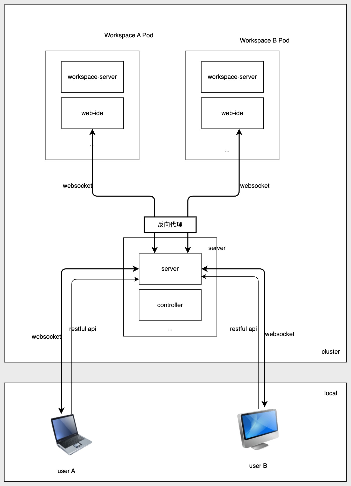
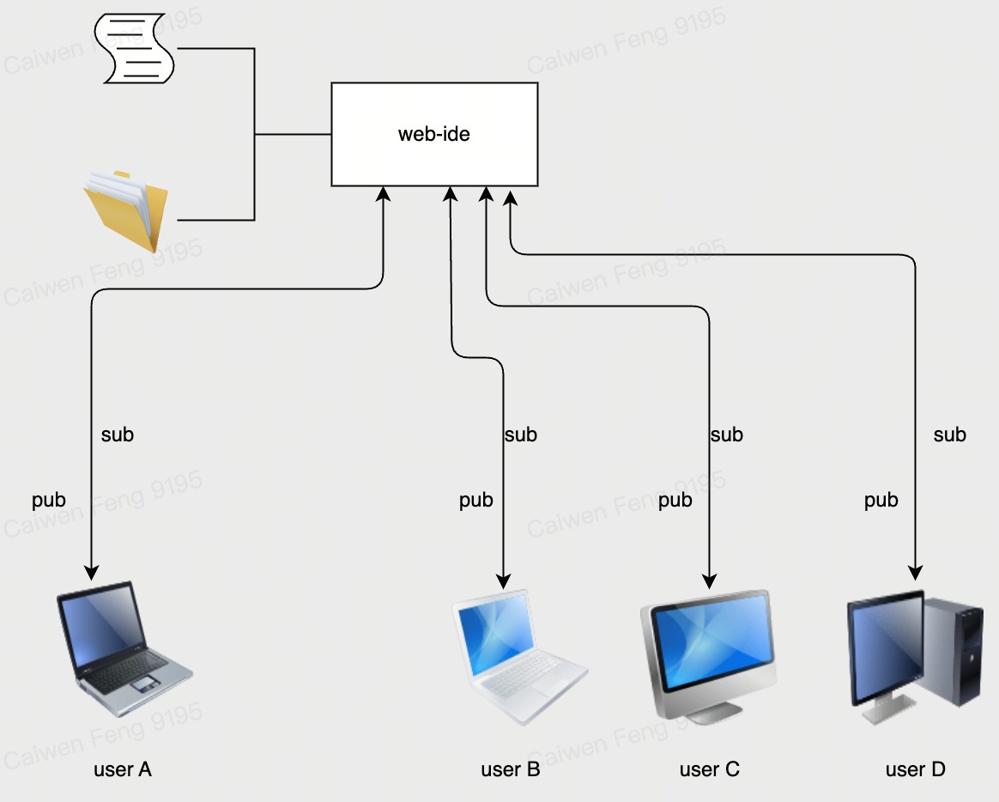

# 常见的逻辑说明

## 正在编辑的文件 A，还没有保存。此时重命名父文件夹 B 为新名称 C，然后保存文件 A，会怎么样？

- 文件夹重命名成功，但为旧文件
- 文件 A 会写到原来的路径 B，而不是新文件夹 C 中

## 用户 A 和用户 B 正在编辑同一个文件，此时 A 写入了一个字符，此时会发生什么事情？

- 后台观察到用户 A 和 用户 B 正在订阅当前文件，则会把当前文件所做的操作，转发到对应的 socket 链接中
- 此时用户 A 和 用户 B 所看到的文件内容一致。
- 用户 B 可以保存由用户 A 修改的内容

# 特性

- 用户 A 可以同时打开 workspace A 和 workspace B ，对应两个不同的 websocket 链接
- 用户 A 和 用户 B 可以同时打开同一个 workspace A 或者 workspace B ，对应两个不同的 websocket 链接

- 打开即订阅
- 关闭即取消订阅