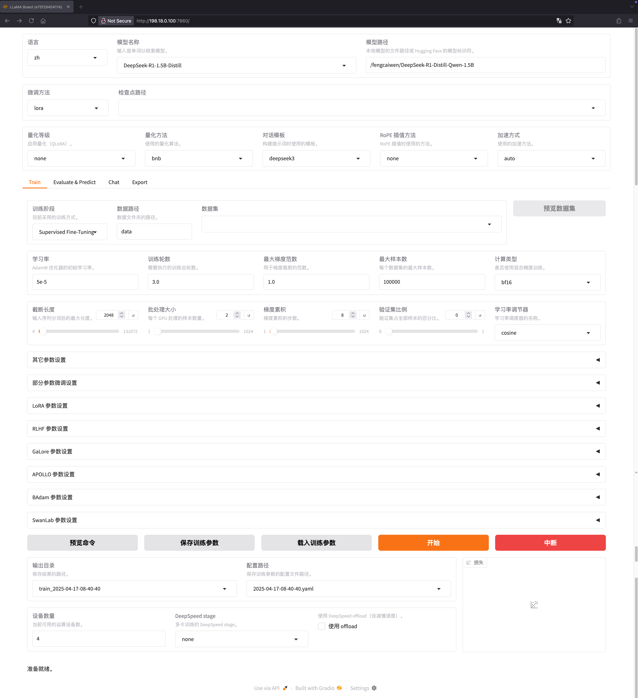

# 使用 LlamaFactory 精调模型

## 步骤

https://github.com/hiyouga/LLaMA-Factory
使用构建好的镜像

#### Nvidia 卡

#### NPU 卡

swr.cn-east-317.qdrgznjszx.com/donggang/llama-factory-ascend910b:cann8-py310-torch2.2.0-ubuntu18.04

```shell
git clone https://github.com/hiyouga/LLaMA-Factory
```

```shell
cd LLaMA-Factory
```

使用 4,5,6,7 四张卡

```shell
docker run -itd \
    -v ./data:/app/data \
    -v ./output:/app/output \
    -p 7860:7860 \
    -p 8000:8000 \
    --shm-size 16G \
    --name llamafactory \
    --network host \
    --gpus '"device=4,5,6,7"' \
    vetought-cn-beijing.cr.volces.com/maas/llamafactory:latest
```

使用所有 GPU 卡

```shell
docker run -itd \
    -v ./data:/app/data \
    -v ./output:/app/output \
    -p 7860:7860 \
    -p 8000:8000 \
    --shm-size 16G \
    --name llamafactory \
    --network host \
    --gpus all \
    vetought-cn-beijing.cr.volces.com/maas/llamafactory:latest
```

```shell
docker exec -it llamafactory nohup llamafactory-cli webui & 
```

使用 kubevpn 链接到 linux 机器。

```shell
kubevpn ssh --ssh-username=root --ssh-addr=101.126.7.2 --ssh-password=xxx
```

浏览器打开地址

```shell
http://198.18.0.100:7860/
```

