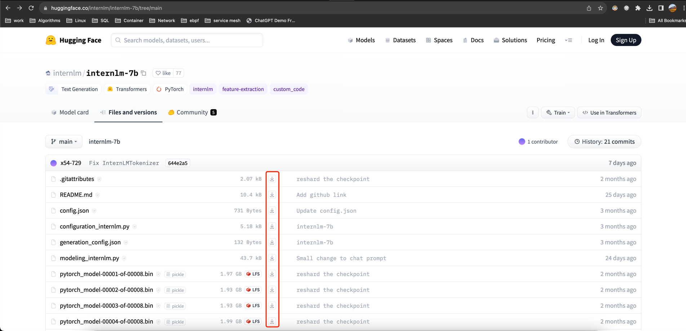
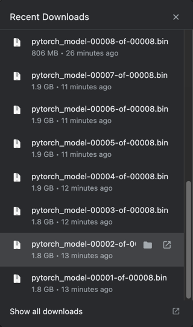
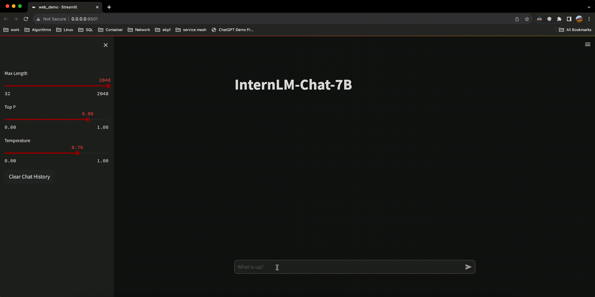

*备注*
chatglm-6b 模型国内下载地址

```shell
https://cloud.tsinghua.edu.cn/d/fb9f16d6dc8f482596c2/
```

# 下载模型文件

一般从 https://huggingface.co/internlm/internlm-7b/tree/main 下载。使用 git clone 总会出现报错，所以直接使用浏览器下载



# 上传文件到 linux server

这里使用 rsync 上传，据说比 scp 上传还快
`https://groups.google.com/g/xidian_linux/c/58jMVPoZKcA`

```shell
rsync -e "~/.ssh/common.pem" -aP ./internlm-7b root@101.126.33.219:/root/howard/InternLM/internlm-7b
```

```shell
➜  rsync -aP ./internlm-7b root@101.126.33.219:/root/howard/InternLM/internlm-7b
building file list ...
19 files to consider
internlm-7b/
internlm-7b/pytorch_model-00001-of-00008.bin
  1969370847 100%   14.63MB/s    0:02:08 (xfer#1, to-check=11/19)
internlm-7b/pytorch_model-00002-of-00008.bin
  1933844137 100%   14.06MB/s    0:02:11 (xfer#2, to-check=10/19)
internlm-7b/pytorch_model-00003-of-00008.bin
  1933844201 100%    9.36MB/s    0:03:16 (xfer#3, to-check=9/19)
internlm-7b/pytorch_model-00004-of-00008.bin
  1990458181 100%   15.18MB/s    0:02:05 (xfer#4, to-check=8/19)
internlm-7b/pytorch_model-00005-of-00008.bin
  1990458775 100%   12.24MB/s    0:02:35 (xfer#5, to-check=7/19)
internlm-7b/pytorch_model-00006-of-00008.bin
  1990458775 100%   12.47MB/s    0:02:32 (xfer#6, to-check=6/19)
internlm-7b/pytorch_model-00007-of-00008.bin
  1990467305 100%   15.59MB/s    0:02:01 (xfer#7, to-check=5/19)
internlm-7b/pytorch_model-00008-of-00008.bin
   845153194 100%   12.92MB/s    0:01:02 (xfer#8, to-check=4/19)
internlm-7b/pytorch_model.bin.index.json
       37116 100%  362.46kB/s    0:00:00 (xfer#9, to-check=3/19)
internlm-7b/special_tokens_map.json
          95 100%    0.92kB/s    0:00:00 (xfer#10, to-check=2/19)
internlm-7b/tokenizer.model
     1658691 100%    5.40MB/s    0:00:00 (xfer#11, to-check=1/19)
internlm-7b/tokenizer_config.json
         343 100%    1.14kB/s    0:00:00 (xfer#12, to-check=0/19)

sent 14638575565 bytes  received 18296 bytes  13674538.87 bytes/sec
total size is 14645813931  speedup is 1.00
```

# SSH 端口转发

```shell
ssh root@101.126.33.219 -L 0.0.0.0:8501:0.0.0.0:8501
```

# 启动 web 服务

```shell
pip install streamlit
streamlit run web_demo.py --server.address 0.0.0.0  -i https://pypi.tuna.tsinghua.edu.cn/simple
```

# 或者也可以在 python 中直接启动

```shell
from transformers import AutoTokenizer, AutoModelForCausalLM
tokenizer = AutoTokenizer.from_pretrained("/root/howard/InternLM/internlm-7b/internlm-7b", trust_remote_code=True)
model = AutoModelForCausalLM.from_pretrained("/root/howard/InternLM/internlm-7b/internlm-7b", trust_remote_code=True).cuda()
model = model.eval()
response, history = model.chat(tokenizer, "你好", history=[])
print(response)
```

```shell
(python39) ➜  InternLM git:(main) ✗ python
Python 3.9.18 (main, Sep 11 2023, 13:41:44)
[GCC 11.2.0] :: Anaconda, Inc. on linux
Type "help", "copyright", "credits" or "license" for more information.
>>> from transformers import AutoTokenizer, AutoModelForCausalLM
>>> tokenizer = AutoTokenizer.from_pretrained("/root/howard/InternLM/internlm-7b/internlm-7b", trust_remote_code=True)
>>> model = AutoModelForCausalLM.from_pretrained("/root/howard/InternLM/internlm-7b/internlm-7b", trust_remote_code=True).cuda()
Loading checkpoint shards: 100%|██████████████████████| 8/8 [00:08<00:00,  1.04s/it]
Some weights of the model checkpoint at /root/howard/InternLM/internlm-7b/internlm-7b were not used when initializing InternLMForCausalLM: ['model.layers.16.self_attn.rotary_emb.inv_freq', 'model.layers.25.self_attn.rotary_emb.inv_freq', 'model.layers.29.self_attn.rotary_emb.inv_freq', 'model.layers.26.self_attn.rotary_emb.inv_freq', 'model.layers.3.self_attn.rotary_emb.inv_freq', 'model.layers.5.self_attn.rotary_emb.inv_freq', 'model.layers.7.self_attn.rotary_emb.inv_freq', 'model.layers.19.self_attn.rotary_emb.inv_freq', 'model.layers.24.self_attn.rotary_emb.inv_freq', 'model.layers.13.self_attn.rotary_emb.inv_freq', 'model.layers.9.self_attn.rotary_emb.inv_freq', 'model.layers.18.self_attn.rotary_emb.inv_freq', 'model.layers.15.self_attn.rotary_emb.inv_freq', 'model.layers.14.self_attn.rotary_emb.inv_freq', 'model.layers.23.self_attn.rotary_emb.inv_freq', 'model.layers.6.self_attn.rotary_emb.inv_freq', 'model.layers.0.self_attn.rotary_emb.inv_freq', 'model.layers.8.self_attn.rotary_emb.inv_freq', 'model.layers.21.self_attn.rotary_emb.inv_freq', 'model.layers.4.self_attn.rotary_emb.inv_freq', 'model.layers.27.self_attn.rotary_emb.inv_freq', 'model.layers.20.self_attn.rotary_emb.inv_freq', 'model.layers.31.self_attn.rotary_emb.inv_freq', 'model.layers.22.self_attn.rotary_emb.inv_freq', 'model.layers.1.self_attn.rotary_emb.inv_freq', 'model.layers.28.self_attn.rotary_emb.inv_freq', 'model.layers.10.self_attn.rotary_emb.inv_freq', 'model.layers.30.self_attn.rotary_emb.inv_freq', 'model.layers.11.self_attn.rotary_emb.inv_freq', 'model.layers.17.self_attn.rotary_emb.inv_freq', 'model.layers.2.self_attn.rotary_emb.inv_freq', 'model.layers.12.self_attn.rotary_emb.inv_freq']
- This IS expected if you are initializing InternLMForCausalLM from the checkpoint of a model trained on another task or with another architecture (e.g. initializing a BertForSequenceClassification model from a BertForPreTraining model).
- This IS NOT expected if you are initializing InternLMForCausalLM from the checkpoint of a model that you expect to be exactly identical (initializing a BertForSequenceClassification model from a BertForSequenceClassification model).
Traceback (most recent call last):
  File "<stdin>", line 1, in <module>
  File "/root/anaconda3/envs/python39/lib/python3.9/site-packages/torch/nn/modules/module.py", line 918, in cuda
    return self._apply(lambda t: t.cuda(device))
  File "/root/anaconda3/envs/python39/lib/python3.9/site-packages/torch/nn/modules/module.py", line 810, in _apply
    module._apply(fn)
  File "/root/anaconda3/envs/python39/lib/python3.9/site-packages/torch/nn/modules/module.py", line 810, in _apply
    module._apply(fn)
  File "/root/anaconda3/envs/python39/lib/python3.9/site-packages/torch/nn/modules/module.py", line 810, in _apply
    module._apply(fn)
  [Previous line repeated 2 more times]
  File "/root/anaconda3/envs/python39/lib/python3.9/site-packages/torch/nn/modules/module.py", line 833, in _apply
    param_applied = fn(param)
  File "/root/anaconda3/envs/python39/lib/python3.9/site-packages/torch/nn/modules/module.py", line 918, in <lambda>
    return self._apply(lambda t: t.cuda(device))
torch.cuda.OutOfMemoryError: CUDA out of memory. Tried to allocate 172.00 MiB. GPU 0 has a total capacty of 21.99 GiB of which 107.00 MiB is free. Including non-PyTorch memory, this process has 21.87 GiB memory in use. Of the allocated memory 21.65 GiB is allocated by PyTorch, and 1.49 MiB is reserved by PyTorch but unallocated. If reserved but unallocated memory is large try setting max_split_size_mb to avoid fragmentation.  See documentation for Memory Management and PYTORCH_CUDA_ALLOC_CONF
>>> model = model.eval()
Traceback (most recent call last):
  File "<stdin>", line 1, in <module>
NameError: name 'model' is not defined
>>> response, history = model.chat(tokenizer, "你好", history=[])
Traceback (most recent call last):
  File "<stdin>", line 1, in <module>
NameError: name 'model' is not defined
>>> print(response)
Traceback (most recent call last):
  File "<stdin>", line 1, in <module>
NameError: name 'response' is not defined
Traceback (most recent call last):
  File "<stdin>", line 1, in <module>
NameError: name 'e' is not defined
>>> exit()
```

# 查看 GPU 用量

```shell
nvidia-smi
```

```shell
(python39) ➜  InternLM git:(main) ✗ nvidia-smi
Tue Oct 17 11:05:20 2023
+---------------------------------------------------------------------------------------+
| NVIDIA-SMI 535.104.12             Driver Version: 535.104.12   CUDA Version: 12.2     |
|-----------------------------------------+----------------------+----------------------+
| GPU  Name                 Persistence-M | Bus-Id        Disp.A | Volatile Uncorr. ECC |
| Fan  Temp   Perf          Pwr:Usage/Cap |         Memory-Usage | GPU-Util  Compute M. |
|                                         |                      |               MIG M. |
|=========================================+======================+======================|
|   0  NVIDIA A10                     On  | 00000000:65:01.0 Off |                    0 |
|  0%   46C    P0              59W / 150W |  14236MiB / 23028MiB |      0%      Default |
|                                         |                      |                  N/A |
+-----------------------------------------+----------------------+----------------------+

+---------------------------------------------------------------------------------------+
| Processes:                                                                            |
|  GPU   GI   CI        PID   Type   Process name                            GPU Memory |
|        ID   ID                                                             Usage      |
|=======================================================================================|
|    0   N/A  N/A    589375      C   .../anaconda3/envs/python39/bin/python    14224MiB |
+---------------------------------------------------------------------------------------+
```

# 效果

